# Factual divergences in Dutch television news: comparisons between AIDS/HIV, SARS and COVID-19 news reportings
by Emillie de Keulenaar and Ivan Kisjes

## Introduction

One of the defining features of the COVID-19 pandemic in the Netherlands has been the early ambiguity of government-issued prevention guidelines. While trust in government measures has arguably risen, the early days of the pandemic were marked by confusion on several “facts” related to the virus: whether people without symptoms and children can or cannot contaminate others; whether cyclists should keep a distance from each other; whether stopping handshakes was a prevention method sufficient to contain such a reputedly contagious virus; and so on.

With the World Health Organisation’s characterisation of COVID-19 as an “infodemic” (United Nations, 2020), the ambiguity of information about the coronavirus has been frequently linked to the diversity of information traversing new media infrastructures. Social media users contest official claims not just with “alternative” theories of events, but also with a pool of information far outside the confines of national broadcasting. Still, the argument that confusion and volatility is heightened by new media may benefit from skepticism, as it is a reputed fact that information stemming from television news was far from homogeneous, and also peddled various medical misinformation (Diem, Lantos and Tulsky, 1996). 

To what extent can we argue that present-day information technologies have made news reporting of official institutional claims more volatile? If we were to compare news media reporting of other complex, international pandemics of the past -- AIDS/HIV and SARS, for example -- would we see a similar effect? 

With archives of Dutch television news media reporting on AIDS/HIV (1980-2000), SARS (2002-2004) and COVID-19 (January 2020 - June 2020), we compared words related to various “facts” about each pandemic in news reports, over time. We specifically looked at what television news programmes have stated about the transmission, prevention, treatments and risk groups and origins of the three pandemics. We used natural language processing techniques to capture words frequently associated with those four issues, filtered them with a pre-set list of true and false issue-specific claims, and compared them across pandemics, over time. 

## Methodological recipe

### Researching television with the Media Suite

While television news continues to be the main information source for most users, little systematic research has been done on data from television news reporting -- most scholars focus on more accessible textual data, such as digital or digitised print news (Gooding, 2018). This is a problem as television broadcasting has shaped public discourse over the past decades. Without access to our televised past, researchers, journalists and citizens cannot bridge the memory of the past with remnants of the present. 

The Media Suite is particularly useful for obtaining what the web usually does not have: recently digitized television programs. It provides a large collection of digitized public television programs, as well as several digitised collections of Dutch media material (Martínez Ortiz et al., 2017; Ordelman, Melgar Estrada and Noordegraaf, 2017). 

Because we wanted to capture what news programmes said about each pandemic, we relied especially on subtitles or transcripts obtained through [Automatic Speech Recognition (ASR)][1]. Through the Jupyter Notebooks, we have extracted all public television news programmes from the archive of the Netherlands Institute for Sound and Vision that contain one of the three pandemics as keywords in all of their metadata (title, subtitles, descriptions…). 

1. AIDS/HIV, during the early outbreak of 1980 all the way to the relative demystification of the disease up until 2000. Merging ASR files of both “HIV” and “AIDS” as queries, we obtained a total of 1,722 results.

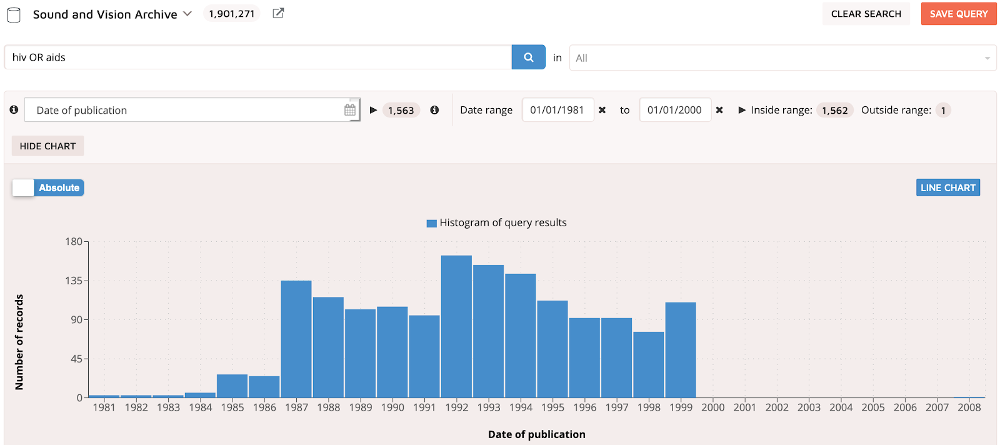
_Fig. 1. Amount of ASR files for the queries “HIV” or “AIDS”_

2. SARS, during the outbreak of 2002 to 2004. The Media Suite returns a total of 822 results.

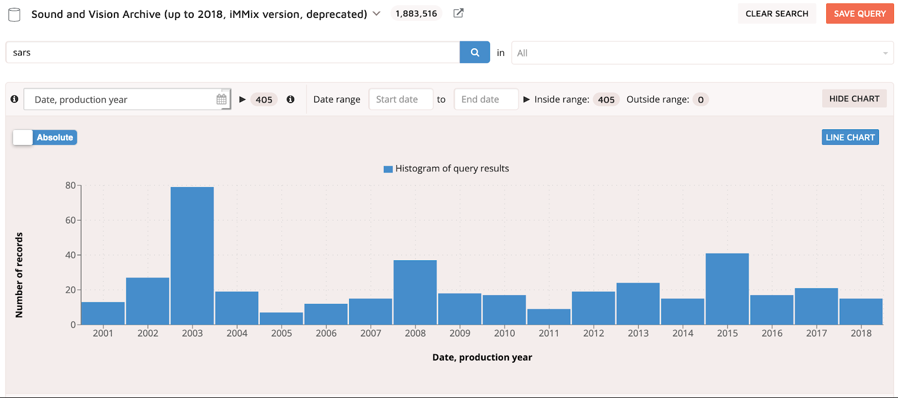
_Fig. 2. Amount of ASR files for the query “SARS”_

3. COVID-19, from early January to present-day June 2020. Drawing our data from the DAAN system, we obtained 3,810 subtitle files. This dataset has been curated differently than others used for this research.

It is worth indicating that not all results were equally transcribed. ASR transcriptions containing the words “AIDS” are nonexistent until about 1999, and have, as such, been merged with those mentioning “HIV”. 

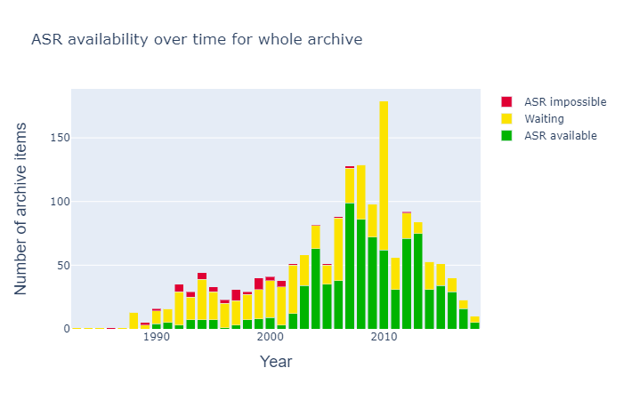
_Fig. 3. ASR availability for programmes mentioning "HIV"_

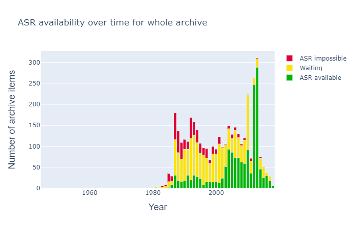
_Fig. 4. ASR availability for programmes mentioning "AIDS"_
### How do we capture “factual ambiguities”?

We have drawn from largely experimental filtering and natural language processing techniques to detect contradicting statements around a single issue. This implied collecting a wide enough range of statements about a given issue. In order to reflect on the widest possible range of statements, we extracted words from sources of both true and false information. To test what news media have said in relation to COVID-19 prevention methods, for example, we first collected a list of words that reflect on the variety of preventative techniques reportedly being used (e.g., masks, social distancing, hand sanitisers...). Wikipedia’s page on COVID-19 is one such source, as it reports information from official channels -- the World Health Organisation, for example -- and also comments on what misinformation has been spread on various aspects of the pandemic.  

To begin capturing [these lists of words -- or “dictionaries”][2] -- we, as indicated above, settled for five topics of each pandemic: 

1. The ways in which each pandemic is **transmitted**;
2. In the case of COVID-19, **whether children can or cannot contaminated others**; 
3. The **treatments** offered for each disease;
4. The **prevention methods** taken for each pandemic;
5. The **risk groups** or **affected populations** of each pandemic.

We collected our “[dictionaries][3]” from several sources (see **appendix: dictionary sources**), each relative to AIDS/HIV, SARS and COVID-19. 

#### Complementing dictionaries inductively

In some instances, ASR transcripts and subtitles would contain words we did not find in our sources. To capture those, we filtered transcripts to a window of a few sentences before and after mentioning one of the five topics we explored (transmission, prevention, treatments, risk groups). In the case of transcripts mentioning COVID-19 transmissions, we have limited our results to sentences that mention “infect”, “contaminated” or similar formulations. 

### Tracing factual ambiguities over time

We then counted the number of times each of the words in our dictionaries is mentioned per month or year in our three ASR and subtitle datasets. We pasted the results into Bernhard Rieder’s Rank Flow visualisation tool to observe the frequency of each term over time. 

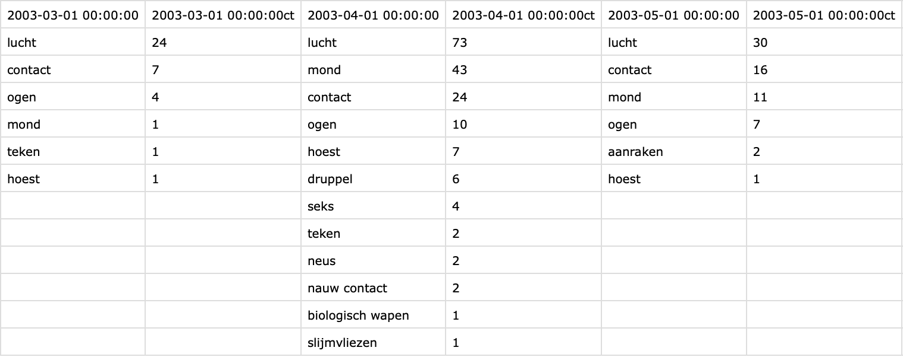
_Fig. 5. Example of results for prevention against SARS_

.png)
_Fig. 6. Method pipeline_

## Findings

### Transmission

#### AIDS/HIV

From 1985 to 1992, news media reported mostly on the sexual aspects of AIDS/HIV transmission. Few information was known in these early days of the pandemic, except that it appeared to affect those engaging in homosexual sexual relations most. It is only in 1992 that news affairs began mentioning blood transfusion and a variety of other vehicles of transmission. News programmes begin to report on wider repertoire of sexual transmissions with additional genders and sexual practices, in particular women (mothers) and heterosexual sex. In 2000, drugs such as heroïne were also mentioned. 

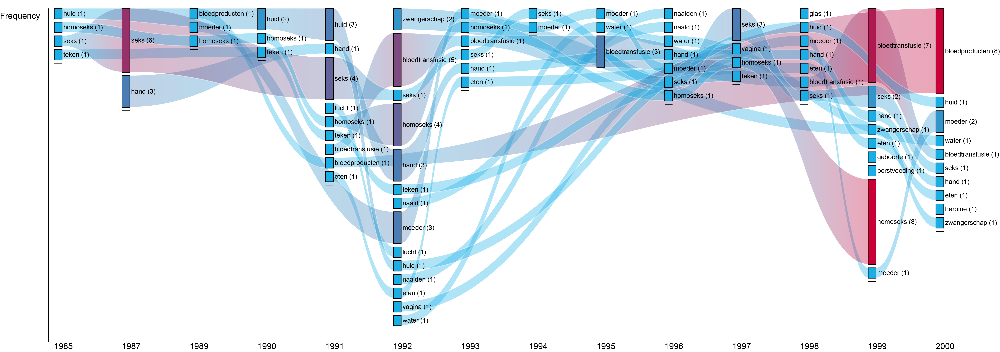
_Fig 7. Most frequently mentioned means of transmission of AIDS/HIV (1985-2000)_

In 1992, Dutch television made an evident intervention in AIDS/HIV debates, notably by having Bam to Bam-Bam singer René Klijn sing in one of its programmes. Klijn was at the time seropositive and two years away from passing, and took time, in the programme, to discuss his disease in the open, reputedly helping to confront some of its taboos. 

_GIF 1. Most frequently mentioned mentions of transmission of AIDS/HIV_

The false methods of transmission — air, skin, eating, water and touch — are either false positives (“[...]() the fight against AIDS must go hand in hand with the fight against poverty.”) or unrelated to reports about transmission (“The Ugandan economy is mainly dependent on agriculture and given the vulnerability of women to food and the fact that agriculture is strongly dependent on women, AIDS has a huge impact on our economy”, with regards to “eating”). 

#### SARS

In the case of SARS, particular attention is given to air or “lucht” for multiple reasons. One the one hand, the term “air” reflects the circumstances, rather than the means, in which SARS was thought to be transmitted to Europe. In April of 2003, news affairs report on the difficulties airports are having in keeping the disease from spreading in the world — they mention how “the representative of the World Health Organization … says China should pay more attention to airport controls.” 

_GIF 2. Most frequently mentioned means of transmission of SARS_

Still, other uses of the word “lucht” do capture true suspicions that, like COVID-19, SARS may be airborne — a question still unclear today (Lewis, 2020). Programs voice open questions on how the virus spread — “Maybe via a doorknob or something with a droplet on it between objects” — and reflect current-day preoccupations on the speed of transmission through invisible means: “the rate of spread now makes it a bit more worrying; perhaps there is transmission possible via its mist in the air, and then you get infectiousness in the direction of influenza virus-like behavior.”

With the exception of mouth, close contact is another frequently reported means of transmission. Early reports on the disease (in March and April 2003) mention how the first four individuals to have been infected in China were “Hong Kong television workers who have been in contact with the first SARS patients this year”, as well as “a waitress that has also been admitted with symptoms of the dangerous lung disease.” Contact or touch remained until late 2004 the principal means of transmission, following the report that “researchers … made significant discoveries about the SARS virus, including finding that the virus can survive for several hours outside the human body” and that “touching a tabletop a doorknob or similar object may be enough to infect.” In other cases, words like “mouth” capture reports on policies for or against wearing masks, rather than evidence that the disease spreads through it. 

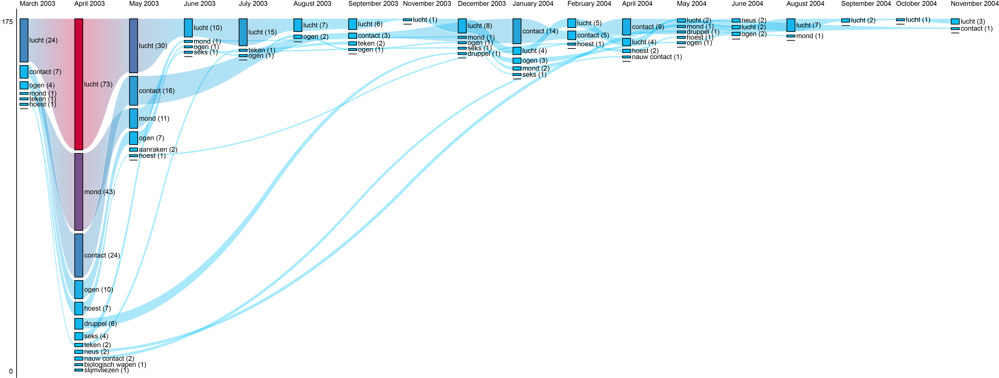
_Fig. 8. Most frequently mentioned means of transmission of SARS (2003-2004)_

#### COVID

In the case of COVID-19, terms such as “hand”, “adem”, “hoesten”, “aanrak” and “druppel” describe the early symptoms associated with coronavirus infections in China and, progressively, Europe. A word like “5g” is an outlier here, as unlike reports on previous pandemics, it addresses the reach of conspiracies spread online — one, in this case, that alleges the relation between “corona contamination … to radiation from 5G transmission masts”. This is noteworthy in the sense that television picks up on misinformation for the sake of exposing it rather than falling prey to it, attesting to news media’s current embodiment of the role of “debunkers”. 

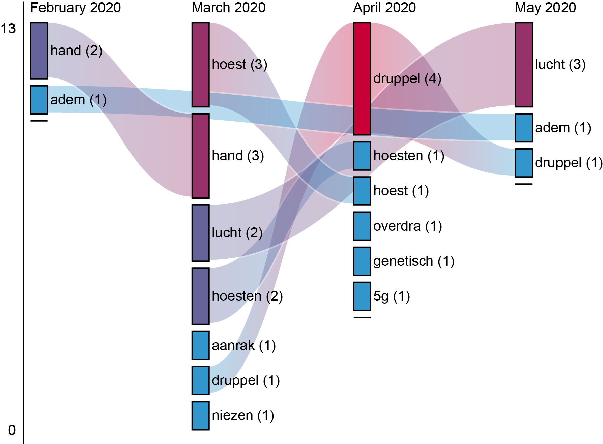
_Fig. 9. Most frequently mentioned means of transmission of COVID-19 (February-May 2020)_

### Are children contagious?

In the Netherlands, there has been significant debate as to whether children are contagious and should be kept from going to school. The transcripts reflect a somewhat nuanced discussion about this matter, with varying affirmations on the extent to which children can or cannot infect others. Early in March, statements reflect both suspicions that children are infectious, or that, all things considered, they may be less contagious. In June, the latter statement becomes more frequent than the former affirmation. Finally, these two statements wrestle between April and June with an intermediary proposition that children are as contagious as adults. 

_GIF 3. Statements related to children, transmission and COVID-19 (February-June 2020)_

### Treatment

#### AIDS/HIV

Since 1990, HIV-inhibitors and zidovudine have been the most frequently mentioned methods of treatments for AIDS/HIV. Only in 1996 do Dutch news media begin to mention a “cocktail” of medications. The exception is the mention of “virgins” in 1997, related to the myth that having sexual intercourse with a virgin will heal one from the disease (“Because teenage pregnancies are the order of the day and about AIDS about the delusion that HIV-positive men get healthy again when they have sex with a virgin.”). This represents something of an exception in comparison to coverage of older pandemics, in that Dutch television assumes here, also, the role of “debunker” of popular myths. 

_GIF 4. Most frequently mentioned treatments for AIDS/HIV (1990-2000)_

#### COVID-19

In the case of COVID-19, the ingredients below are rarely framed as viable cures. Rather, news programmes assess the plausibility of some medications (“Ibuprofen, does that backfire?”; “Do not buy more acetaminophen than you need.”; “Does paracetamol actually make sense?”; “If it is really not wearable, you can use acetaminophen.”; “In France, it is not recommended to use ibuprofen.”), and sometimes report external research (“China has started testing the pre-existing virus inhibitor Remdesivir on coronavirus patients.”). 

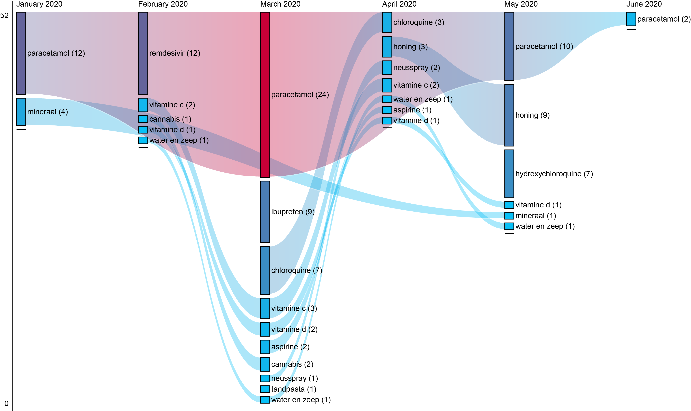
_Fig. 10. Most frequently mentioned treatments for COVID-19 (January-June 2020)_

As they did previously with their coverage of COVID-19 transmissions, they also perform fact-checking, as when demystifying reports that cannabis or vitamin C are viable preventatives (“From stories that cannabis and vitamin C would protect you ... to an Indian study that showed the virus contains HIV parts.”). In other cases, news affairs will give voice to individuals with doubtful opinions, perhaps to reflect on the prevalence of misinformation during the COVID-19 crisis: “The World Health Organisation follows entrepreneurs who try to keep their heads above water in this corona crisis. If you strengthen your immune system with zinc and vitamin D ... and you are going to use a means that many people use ... then no one needs to be afraid anymore. And also a mineral.”; “If you are infected yourself, warm water and soap is of course not enough.”; “Or buy a special toothpaste to make sure you don't get the virus.”. 

### Prevention

#### AIDS/HIV

Of a few preventative methods we have found for AIDS/HIV infections, only two are mentioned in news affairs: condoms and monogamous relationships. Here, too, results do not imply affirmative statements for the use of condoms or for maintaining monogamous relationships as a preventative method. On the contrary: television broadcasts merge several opposing statements, including testimonies exemplary of different or unusual opinions (e.g., a woman stating that one should rather restrict oneself to one partner than use condoms). 

> “There are no easy solutions and thirdly the condom is not the solution. The cordon always has a very limited place in the fight against AIDS in the world especially in developing countries. [...]() When asked how to prevent infection with the HIV virus, one of the women present has the desired answer: ‘You should limit yourself to one partner and if you cannot use condoms.’ [...]() In particular, there are still many resistances against the actual use of condoms, according to the cup of the AIDS information center. Their use is not consistent with the sexual habits in Zambia.”

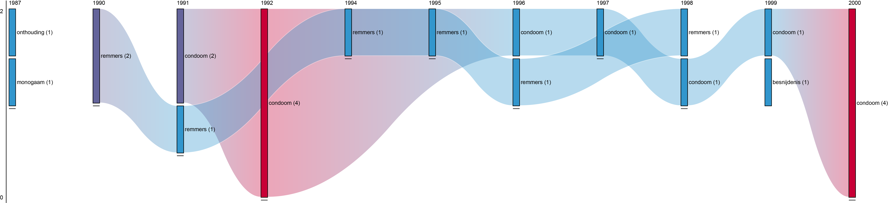
_Fig. 11. Most frequently mentioned methods of prevention for AIDS/HIV (1987-2000)_

Also remarkable is the mention of the Church in the early 1980s as partaking in the official approval of the use of condoms for AIDS/HIV prevention. The Catholic Church’s position on the use of contraceptives (including condoms) [has for decades been controversial][7], with [recent Popes only timidly approving contraceptives][8] as a method to prevent the transmission of the disease. 

> “The Roman Catholic bishops in the Netherlands set up a committee of experts to help them form an opinion about the use of condoms, following the comments of Bishop Muskens of Breda, who understands that nuns and priests in Africa hand out condoms for something to fight against the spread of AIDS.”

#### COVID-19

In the case of COVID-19, reports on preventive methods often act to debunk orthodox ideas by politicians and other individuals. This is particularly the case for the term “sauna”, which an individual reportedly uses to say that “Sitting in the sauna for 20 minutes will kill the coronavirus.”. The term “vodka” is used to refer to a statement by Belarusian President Lukashenko, who reportedly suggested that the coronavirus “is best combated with vodka.”

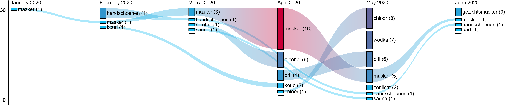
_Fig. 12. Most frequently mentioned methods of prevention for COVID-19 (January-June 2020)_

Other times, transcripts voice a certain dissatisfaction with the Dutch government’s passivity with regards to reinforcing measures to wear masks in public. One transcript extract mentions that the World Health Organisation “now advises all healthcare providers in hospitals to wear a mask” — but that “in recent weeks, the House of Representatives has really only been about corona AND about cold chocolate milk.” 

### Are COVID and SARS more democratic pandemics?

#### AIDS/HIV

Early reporting on AIDS/HIV infections focused especially on the sexual lifestyle of those affected by the disease. This may explain the frequency of words like “prostitutes”, “homos” or “homoseksuelen” all the way until 1997, although other gender and sexual identities are no exception: women, men and heterosexuals are mentioned from 1990 onwards. It was only in 1991 that the news media began linking the disease of other lifestyles, such as drug use. 

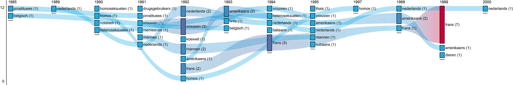
_Fig. 13. Most frequently mentioned risk groups for AIDS/HIV (1985-2000)_

From 1997 onwards, sexual lifestyles and genders are sidelined by nationalities — perhaps due to the weight of campaigns against stigmas associated to homosexuality and AIDS/HIV. 

_GIF 5 - Most frequently mentioned AIDS/HIV risk groups or affected populations_

#### SARS

With the exception of the elderly, sexual and socio-economic identities are rarely mentioned. Instead, reports focus on the nationalities of individuals affected throughout the pandemic. 

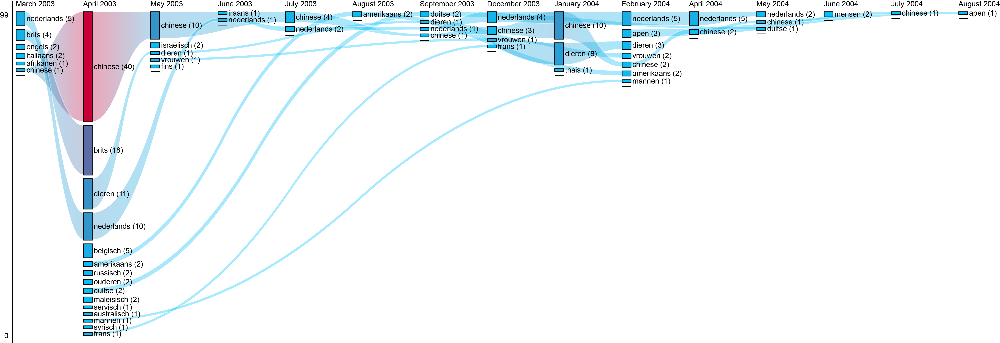
_Fig. 14. Most frequently mentioned risk groups for SARS (2003-2004)_

This is particularly visible in April 2003, when the mention of Dutch, British, Italian, African and Chinese individuals is dramatically outnumbered by several new nationalities: Russian, Serbian, German, American, Syrian, French. As the disease is successfully quarantined in China, the mention of nationalities narrows down to remaining Chinese patients. 

#### COVID-19

Similarly, with the exception of the elderly, news affairs frequently report the nationalities of those infected by COVID-19. Reports have a somewhat local coverage, as Germans are frequently mentioned — despite not being as affected as Chinese and American nationals. 

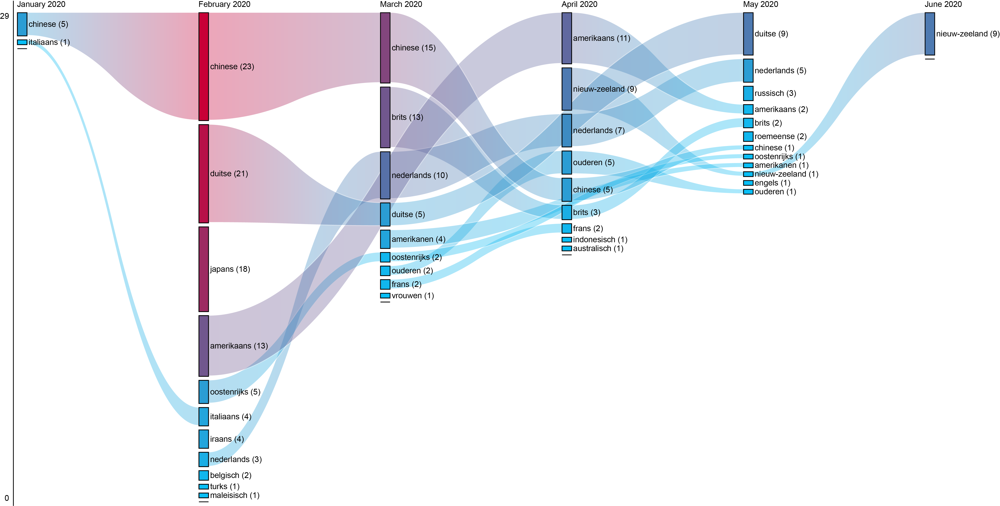
_Fig. 15. Most frequently mentioned risk groups for COVID-19 (January 2020 - June 2020)_

## Conclusions

Though we have found few instances of Dutch television peddling misinformation on AIDS/HIV, SARS, and COVID-19, we have instead found that in the case of COVID-19, it has frequently reported on false beliefs and statements for the sake of demystifying falsehoods. It is remarkable, in this sense, that news affairs have embraced misinformation as an issue of formal and professional concern, expanding their rubric to debunk misinformation as part of their journalistic duty.  

Coverage of all pandemics have been susceptible to considerable changes in tone and factual statements. This is to be expected, as both knowledge and treatments of the disease are affected by research, epidemiology, and the societal debates held around each of these diseases. Still, coverage of some diseases have seen contradicting statements made at the same time -- and this perhaps contributes most to public confusion. This is particularly the case with COVID-19’s debate on whether children can or cannot be infectious, as news affairs covered all possible statements on the issue -- that children are equally, less or more contagious than adults -- in the month April 2020 alone.

Finally, we must throw one word of caution around the method used for this data story. Using dictionaries, we have covered a limited range of factual statements on AIDS/HIV, SARS and COVID-19. Thus, we must have failed to capture additional statements outside of our dictionary, and oftentimes picked up on several false positives. Still, this method stands as an attempt to diversify current research methods to study misinformation, particularly as an alternative to misinformation detection or “flagging”. 

This work was conducted by Emillie Van de Keulenaar (University of Amsterdam), under the supervision of Dr Jasmijn van Gorp (University of Utrecht). Dr Ivan Kisjes (University of Amsterdam) provided the analysis code, and Mari Wigham (Sound and Vision) supplied the data.

## References
Accessible [here](appendix-references)

## Appendix: dictionary sources
Accessible [here](appendix-sources)
## Appendix: dictionaries

Accessible [here][9].

## Appendix: code

Accessible [here](appendix-code)

[1]:	http://mediasuitedata.clariah.nl/dataset/nisv-catalogue
[2]:	https://docs.google.com/document/d/1K7xkkQzaPwcsZWpiDx2mQvNwUPWg2CVWiRItpFMSpJ0/edit#heading=h.smihynddokho
[3]:	https://docs.google.com/spreadsheets/d/1MSdMuwjw-XO3_tY0ixKp0wQMkHcIrc38vziSZREnRE4/edit?usp=sharing
[7]:	https://en.wikipedia.org/wiki/Catholic_Church_and_HIV/AIDS
[8]:	https://www.nytimes.com/2010/11/24/world/europe/24pope.html
[9]:	https://docs.google.com/spreadsheets/d/1MSdMuwjw-XO3_tY0ixKp0wQMkHcIrc38vziSZREnRE4/edit?usp=sharing

