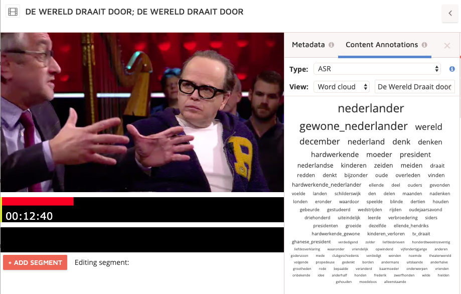

**Sinds bekend is dat DWDD stopt, worden overal lijstjes gedeeld, discussies gevoerd en conclusies getrokken over het programma. Vaak op basis van het spreekwoordelijke bierviltje. Zou het ook anders kunnen? Onderzoekers kijken naar patronen in data, zoals alle DWDD data opgeslagen in het Beeld en Geluid archief. Kijk mee door de lens van de [Media Suite](https://mediasuite.clariah.nl/) en ontdek wat er zoal valt af te leiden uit 15 seizoenen DWDD (2005-2020) als je puur naar de data kijkt.**

De Media Suite is een online omgeving speciaal bedoeld voor onderzoekers. Ze kunnen er gebruikmaken van alerlei hulpmiddelen die voor hen nuttig zijn als ze met grote databronnen aan de slag willen. Denk aan diverse uitgebreide zoekmogelijkheden, het inspecteren van de achterliggende metadata, het visualiseren van patronen en het maken van aantekeningen en annotaties. Onderliggend maakt de Media Suite gebruik van moderne technieken zoals automatische spraak- en beeldherkenning om het speuren in de radio- en televisiearchieven te vergemakkelijken.

### Metadata

Het archief van Beeld en Geluid gaat vele jaren terug en door de tijd heen is er op verschillende manieren gearchiveerd. Voor deze data story – een verhaal gebaseerd op data - hebben we naar traditionele, handmatig ingevoerde [metadata](https://www.beeldengeluid.nl/kennis/kennisthemas/metadata) gekeken maar ook naar moderne, automatisch gegenereerde metadata. Met behulp van technieken uit de 'kunstmatige intelligentie' zijn we zo in staat om 15 jaar DWDD aan de hand van het gesproken woord en het beeld zelf te analyseren en te visualiseren.

Voorbeelden van visualisaties gebaseerd op handmatig door archivarissen toegekende metadata zie je in Figuur 1 en 2. Op een wereldkaart en kaart van Nederland worden de meest besproken locaties (2 keer of meer) in 15 jaar DWDD weergegeven. Niet geheel onverwacht ging het blijkbaar relatief vaak over de Verenigde Staten (op wereldschaal) en Amsterdam (binnen Nederland). Opvallend is dan weer dat het relatief vaak over Uruzgan is gegaan.

<iframe src='https://public.flourish.studio/visualisation/1655704/embed' frameborder='0' scrolling='no' style='width:100%;height:420px;'></iframe>

_Figuur 1: De meest besproken locaties in 15 jaar DWDD op wereldschaal (toegekend door archivarissen)._

<iframe src='https://public.flourish.studio/visualisation/1560024/embed' frameborder='0' scrolling='no' style='width:100%;height:600px;'></iframe>

_Figuur 2: De meest besproken locaties in 15 jaar DWDD in Nederland (toegekend door archivarissen)._

Omdat we in bovenstaande statistieken gebruikmaken van de handmatige metadata, weten we bij voorbaat dat deze statistieken wel heel betrouwbaar zijn (de kans op een fout is klein) maar ook, dat het heel waarschijnlijk is dat we besproken of genoemde locaties hebben gemist. Stel dat we woord voor woord zouden turven hoe vaak locaties worden genoemd komen we op andere cijfers. Het wordt dan alleen de vraag of het noemen van een locatie ook betekent dat het écht over die locatie gaat. Daar zit een stukje interpretatie in dat traditioneel door archivarissen werd uitgevoerd.

Met relatief eenvoudige middelen zou je iets aan automatische interpretatie kunnen doen: door het aantal keer dat een locatie, binnen een kort tijdsbestek wordt genoemd, te tellen bijvoorbeeld. De metadata van het Beeld en Geluid archief bestaat uit beschrijvingen die representeren hoe menselijke archivarissen gebeurtenissen in een programma interpreteren. Maar omdat televisie een visueel medium is, is het bij uitstek geschikt om beeldanalyse op toe te passen: software naar alle afleveringen te laten kijken en de beelden te analyseren.

### TV-geschiedenis

27 maart 2020 kwam een einde aan een tijdperk uit de Nederlandse tv-geschiedenis. DWDD was een van de populairste en invloedrijkste programma’s op de televisie. Kenmerkend voor DWDD is het hoge tempo waarin onderwerpen elkaar afwisselen en het brede scala aan onderwerpen dat ter tafel komt. Met de Media Suite kun je die afwisseling zichtbaar maken door de onderwerpen in een zogenaamde woordenwolk weer te geven, zoals hieronder in Figuur 3. Je ziet hier de door archivarissen aan DWDD uitzendingen toegekende onderwerpen.

_Figuur 3: Woordenwolk van de Top 100 meest voorkomende onderwerpen (toegekend door archivarissen)._

### Distant and close reading

Weergaves zoals woordenwolken geven een overzicht van de spreiding van onderwerpen over alle DWDD uitzendingen, als het ware vanuit een helicopterview. Dit wordt ook wel _distant reading_ genoemd. Met de Media Suite kun je steeds verder inzoomen, om bijvoorbeeld de exacte aantallen per onderwerp te zien, zoals hieronder in Figuur 4. Om uiteindelijk individuele programma’s zelf en de specifieke onderwerpen te gaan bekijken en analyseren, zoals te zien is in Figuur 5. Dat wordt _close reading_ genoemd.

<iframe src='https://public.flourish.studio/visualisation/1625100/embed' frameborder='0' scrolling='no' style='width:100%;height:600px;'></iframe>

_Figuur 4: Top 10 meest frequente onderwerpen in termen van aantal afleveringen van DWDD, gemeten in de periode 2005-2015._

_Figuur 5: Screenshot van een woordenwolk op het niveau van een individueel programma in de Media Suite ten behoeve van 'close reading'. Klikken op een term brengt je naar het fragment in het programma._

### Data criticism

Wat we er bij bovenstaande statistieken wel bij moeten vertellen is dat bij de 'exacte aantallen' in Figuur 4 wel rekening moeten houden met het feit dat de data niet altijd compleet zijn. Van 35% van de DWDD uitzendingen is het onderwerp ook daadwerkelijk ingevuld. Dat kan verschillende oorzaken hebben. Handmatig toekennen van onderwerpen is veel werk en door de jaren heen was er soms meer en soms minder tijd voor of veranderden procedures voor het toekennen. Zie ook Figuur 6 hieronder die laat zien dat de onderwerpen door de heen niet altijd zijn ingevuld, met name in de laatste jaren.

_Figuur 6: Overzicht van de beschikbaarheid van onderwerplabels in DWDD door de jaren heen._

### Oerknal

Het meest invloedrijk is DWDD waarschijnlijk geweest met ingewikkelde materie toegankelijk maken voor een breed publiek. Zo legde Robbert Dijkgraaf in Jip en Janneke-taal uit wat de oerknal inhoudt en kunnen we de volgende dag meepraten over technologische ontwikkelingen na een item met Alexander Klöpping. In Figuur 7 zien we dat wetenschap goed is vertegenwoordigd bij DWDD. Ons vermoeden zou zijn dat als we het aantal wetenschappelijke onderwerpen besproken in DWDD zouden vergelijken met andere tv-programma, DWDD er met kop en schouders bovenuit zou steken. Inderdaad zien we in Figuur 8 dat DWDD het heel goed doet in vergelijking tot actualiteiten- en praatprogramma's (_current affairs_ en _chat shows_).

<iframe src='https://public.flourish.studio/visualisation/1625272/embed' frameborder='0' scrolling='no' style='width:100%;height:600px;'></iframe>

_Figuur 7: Top 10 meest besproken (door archivarissen toegekende) wetenschappelijke onderwerpen in termen van aantal afleveringen van DWDD, gemeten in de periode 2005-2015._

<iframe src='https://public.flourish.studio/visualisation/1731894/embed' frameborder='0' scrolling='no' style='width:100%;height:600px;'></iframe>

_Figuur 8: Aantal afleveringen waarin bepaalde wetenschappelijke onderwerpen besproken worden (toegekend door archivarissen), gemeten in de periode 2005-2015._

### Sprekende data

Matthijs van Nieuwkerk is “verbaal behendig, vloeiend en dwingend,” vat Genootschap Onze Taal samen in [Trouw](https://myprivacy.dpgmedia.net/?siteKey=w38GrtRHtDg4T8xq&callbackUrl=https://www.trouw.nl/privacy-wall/accept?redirectUri=%2fcultuur-media%2fmatthijs-van-nieuwkerk-gooit-het-roer-om%7eb63fd414%2f). Hij staat erom bekend dat hij snel praat. Een gemiddelde spreker produceert zo'n 130 woorden per minuut, een snelle spreker 160. De vraag is, kunnen we berekenen wat Matthijs van Nieuwkerk doet? We maken daarbij gebruik van 2 automatische technieken: sprekerherkenning om te zien wie er wanneer ('who speaks when') en spraakherkenning om het aantal woorden te tellen. We hebben de spreeksnelheid gemeten in 266 afleveringen van DWDD. Om ook nog even een vergelijk te maken met Eva Jinek hebben we ook haar spreeksnelheid gemeten in de eerste 2 minuten van 39 afleveringen van Jinek. We komen dan bij Matthijs uit op een gemiddelde van 176 en bij Eva op 175. Allebei snelle sprekers dus!

Hoewel Matthijs en Eva even snel praten tijdens de show, verschilt de snelheid in hun intro (we zijn uitgegaan van de eerste 2 minuten), die bij Matthijs richting de 181 gaat, iets sneller dus, terwijl Eva juist rustiger aan doet richting 165. Zet de intro de toon van het programma? Een interessant onderzoek zou kunnen zijn om te kijken of de spreeksnelheid van tv-presentatoren door de jaren heen is veranderd.

Met behulp van sprekerherkenning kunnen we ook berekenen hoeveel tijd van het programma een presentator aan het woord is. In Figuur 9 vergelijken we Eva Jinek, Matthijs van Nieuwkerk en Jeroen Pauw in de seizoenen 2018 en 2019 en zien we dat Eva Jinek haar gasten iets meer ruimte lijkt te geven en wat minder aan het woord is dan de mannen. Wellicht een interessant onderwerp voor een vervolgonderzoek van een stagiair: is het zo dat vrouwelijke talkshowhosts hun gasten meer aan het woord laten dan hun mannelijke collega’s?

<iframe src='https://public.flourish.studio/visualisation/1732423/embed' frameborder='0' scrolling='no' style='width:100%;height:600px;'></iframe>

_Figuur 9: Percentages van het programma waar de presentator aan het woord is._

### Matthijs is DWDD

De Top 5 van beste kijkcijfers van DWDD bestond begin maart 2020 nog uit:

- 23 maart 2015: 2.151.000 kijkers
- 20 januari 2017: 2.016.000 kijkers
- 9 november 2016: 1.998.000 kijkers
- 8 januari 2014: 1.782.000 kijkers
- 2 maart 2018: 1.767.000 kijkers

In de laatste week van DWDD zijn deze data allemaal uit de top verstoten door de uitzendingen van 23, 16, 20, 19 en 17 maart 2020 die nu de best bekeken DWDD uitzendingen ooit (tussen de 2.151.000 en 4.561.000 kijkers). Het coronavirus vormt een rode draad in deze uitzendingen. Is Matthijs onze hoop in bange dagen? Of houden Nederlanders niet van verandering? Vaststaat dat DWDD piekt in populariteit met de aller-allerlaatste uitzendingen.

In het begin werd DWDD gepresenteerd door Francisco van Jole (23 keer tot december 2005). Uit de Media Suite haalden we dat ook Claudia de Breij DWDD 57 keer presenteerde door de jaren heen. Maar de populariteit van het programma is vooral te danken aan Matthijs van Nieuwkerk. Matthijs ís DWDD.

    

_Figuur 10: Beeldvisualisatie van Matthijs van Nieuwkerk met één keyframe per maand in 15 seizoenen._

Zie je verandering in kledingstijl? We vroegen ons ook af hoe het programma door al die jaren heen visueel is veranderd of juist niet. Daarom zoomden we in op een heel herkenbaar onderdeel van het format: het DWDD openingsshot.

### Gekruiste armen

Om 15 jaar aan openingsshots te kunnen bekijken hebben we in 2 stappen automatische beeldanalyse toegepast. Eerst hebben we automatische _shot detectie_ gebruikt om de verschillende shots van het programma los te knippen. Voor elk shot in het programma heb je dan één beeld. Vervolgens hebben we met deze beelden _machine learning_ toegepast en een model getraind om specifiek openingsshots te kunnen detecteren.

Gewapend met een heuse openingsshot-detector zijn we door 2826 afleveringen gegaan om heel veel shots van Matthijs van Nieuwkerk met gekruiste armen te vinden! In Figuur 11 hieronder zie je deze poses sinds het begin van DWDD achter elkaar gezet. (Suggestie: beweeg met de muis over het plaatje om de losse shots te zien).

<iframe src='https://beeldengeluid.github.io/frameviewer-dwdd/' frameborder='0' scrolling='no' style='width:100%;height:213px ;'></iframe>

_Figuur 11: 15 jaar ‘welkom’ door Matthijs van Nieuwkerk in één beeldje per maand._

### Werken met de Media Suite

De Media Suite is een online onderzoeksomgeving, beheerd door Beeld en Geluid, die is ontwikkeld in het [CLARIAH](https://www.clariah.nl/en/) project speciaal voor (data-gedreven) onderzoek. Media Suite biedt toegang tot multimediale bronnen van diverse Nederlandse archieven zoals die van Beeld en Geluid, verrijkt met behulp van spraak- en beeldherkenning. [Lees meer over de Media Suite](https://mediasuite.clariah.nl/documentation/faq/what-is-it).

Door data te analyseren kun je trends ontdekken of juist onregelmatigheden opsporen. De data-visualisaties in deze blog geven een beeld van DWDD als geheel en onthullen bijzonderheden die prikkelen om verdere vragen te stellen.

### Kritische kijk op data

Data bieden geen absolute waarheid maar worden gekleurd door de processen waarmee ze zijn verzameld. Voorheen werden DWDD afleveringen handmatig voorzien van metadata. Sinds 2015 worden veel metadata automatisch gegenereerd, bijvoorbeeld door spraak, stemmen of gezichten te herkennen. Handmatige metadata zijn meestal van goede kwaliteit, maar door de jaren heen is de manier van werken regelmatig veranderd. Daardoor kunnen verschillen optreden in zowel kwaliteit en rijkheid van de data. Maar we weten bijvoorbeeld vrij zeker dat wanneer er iemand als gast staat genoteerd, diegene ook daadwerkelijk in die uitzending aanwezig was.

Maar stel je voor dat er in diezelfde uitzending iemand te gast was die pas later een 'Bekende Nederlander' is geworden. Die persoon zal mogelijk niet door de archivaris zijn opgemerkt. Dat is dan weer het voordeel van automatische processen: als iemand een paar zinnen heeft gesproken, kunnen we hem of haar jaren later alsnog terugvinden. Natuurlijk kunnen automatische processen ook fouten maken en hierdoor voor wat ruis zorgen. Daarom volgen we 2 principes bij de inzet van automatische technieken: we houden de kwaliteit goed in de gaten en bieden de onderzoekers zoveel mogelijk inzicht in de gebruikte technieken zodat ze zelf de data die uit de tools komen kunnen interpreteren.

_Met bijdragen van: Philo van Kemenade, Wytze Koppelman, Nanne van Noord, Roeland Ordelman, Muriel van Peteghem en Mari Wigham._
