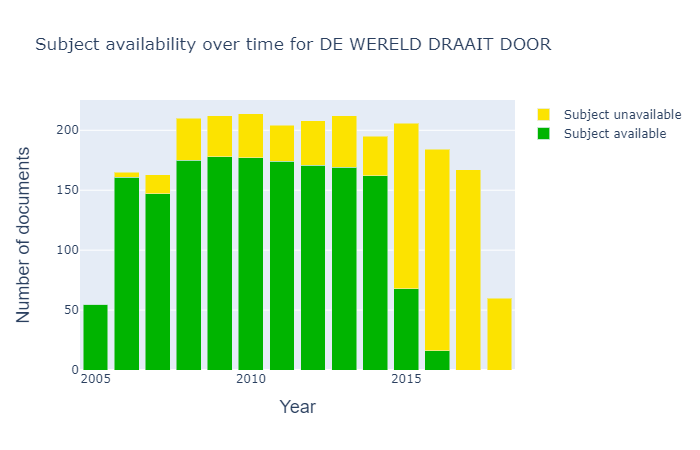

**Since it became known that [DWDD](https://en.wikipedia.org/wiki/De_Wereld_Draait_Door) was going to stop, people everywhere have been discussing the programme, sharing lists and drawing conclusions, often on the back of the proverbial napkin. Is there another way to do this? Researchers look for patterns in data, such as the DWDD data stored in the Dutch [Sound and Vision archive](https://en.wikipedia.org/wiki/Netherlands_Institute_for_Sound_and_Vision). Join us to look through the lens of the [Media Suite](https://mediasuite.clariah.nl/) and discover what we can find out about 15 seasons of DWDD (2005-2020) by looking purely at the data**

The Media Suite is an online environment intended specially for researchers. They can use various aids that are useful for them when they want to work with large datasets. Think of various advanced search capabilities, inspecting the underlying metadata, visualising patterns and making notes and annotations. Under the hood, the Media Suite uses modern techniques such as automatic speech and image recognition, to make it easier to nose around in the radio en television archives.

### Metadata

The Sound and Vision archive goes back many years, and during that time the archiving process has gone through many changes. For this 'data story' – a story based on data - we have looked at traditional, manually entered metadata, but also modern, automatically generated metadata. With the help of 'artificial intelligence' techniques, we are able to analyse and visualise 15 years of DWDD based on spoken words and images.

Examples of visualisations based on metadata that was manually entered by archivists can be seen in Figures 1 and 2. The most frequently (twice or more) discussed locations from manually annotated DWDD programmes are plotted on a world map and a map of the Netherlands. It is not terribly surprising that the discussion was apparently quite frequently about the United States (on a global scale) and Amsterdam (within the Netherlands). What is more remarkable, is that Uruzgan feature relatively often.

<iframe src='https://public.flourish.studio/visualisation/1925837/embed' frameborder='0' scrolling='no' style='width:100%;height:420px;'></iframe>

_Figure 1: The most frequent discussed locations in 15 years DWDD on a global scale (annotated by archivists)._

<iframe src='https://public.flourish.studio/visualisation/1926238/embed' frameborder='0' scrolling='no' style='width:100%;height:600px;'></iframe>

_Figure 2: The most frequent discussed locations in 15 years DWDD in Netherlands (annotated by archivists)._

As we use manually entered metadata in the statistics above, we know that they are very reliable (the chance of an error is small) - but also that it is highly likely that we have missed some locations that were discussed or mentioned. Supposed that we were to go through the programmes word by word and count up how often locations were mentioned, then we would come up with different numbers. The question then is whether the fact that a location was mentioned also means that the discussion was really about the location. This interpretation step is traditionally done by the archivist.

With relatively simple means, we could do some sort of automatic interpretation: for example by counting how often a location was mentioned within a certain timeframe. We could also go beyond the spoken word. The metadata from the Sound and Vision archive consists of descriptions that represent how human archivists interpret the events in a programme. But because TV is a visual medium, it is eminently suited to image analysis: letting software examine each programme and analyse the images. 

### TV history

The 27th of March 2020 brought the end of an era in Dutch TV history. DWDD was one of the most popular - and influential - programmes on television. DWDD was characterised by the high speed with which subjects were alternated, and the wide range of subjects that were brought to the table. With the Media Suite we can make that variety visible by showing the subjects in a so-called 'word cloud', as shown below in Figure 3. Here you can see the subjects that archivists annotated DWDD programmes with. 

_Figure 3: Wordcloud of the top 100 most frequently occurring subjects (annotated by archivists)._

### Distant and close reading

Representations such as word clouds can give an overview of the spread of subjects over all DWDD programmes, in a sort of birds-eye view. This is also called _distant reading_. With the Media Suite you can zoom in further, for example to see the exact number of programmes for each subject, as seen below in Figure 4. Ultimately, the individual programmes and their subjects can be viewed and analysed, as is shown in Figure 5. This is called _close reading_.

<iframe src='https://public.flourish.studio/visualisation/1823202/embed' frameborder='0' scrolling='no' style='width:100%;height:600px;'></iframe>

_Figure 4: Top 10 most frequent subjects in termes of number of DWDD programmes, measured in the period 2005-2015._

_Figure 5: Screenshot of a word cloud on the level of an individual programme in the Media Suite, to assist 'close reading'. Clicking on a term jumps the viewer to that fragment in the programme _

### Data criticism

What we must tell about the statistics above is that when looking at the 'exact values' in Figure 4, it is essential to take into account the fact that the data are not always complete. The subject was actually filled in for 35% of the DWDD programmes. This can have many reasons. Manual annotation of subjects is a lot of work, and at different points through the years there was more or less time available for this, or there were changes made in annotation procedures. See also Figure 6 below that shows that the subjects were not always filled in over the lifetime of the programme, namely in recent years.

_Figure 6: Overview of the availability of subject labels in DWDD over the years._

### The Big Bang

DWDD was probably most influential in bringing complicated subject matter to a wider audience. Robbert Dijkgraaf explained the Big Bang in simple terms, and the day after an item by Alexander Klöpping we could all converse about the latest technological developments. In Figure 7 we can see that science was well represented in DWDD. Our assumption would be that if we compared the number of scientific subjects discussed in DWDD with another TV programme, that DWDD would win hands down. Indeed, we see in Figure 8 that DWDD scores very well compared to current affairs and chat shows.

<iframe src='https://public.flourish.studio/visualisation/1823409/embed' frameborder='0' scrolling='no' style='width:100%;height:600px;'></iframe>

_Figure 7: Top 10 most frequently discussed scientific subjects (annotated by archivists) in terms of number of DWDD programmes, measured in the period 2005-2015._

<iframe src='https://public.flourish.studio/visualisation/1824353/embed' frameborder='0' scrolling='no' style='width:100%;height:600px;'></iframe>

_Figure 8: Number of programmes in which certain scientific subjects were discussed (annotated by archivists), measured in the period 2005-2015._

### The data speaks for itself

Matthijs van Nieuwkerk, the presenter of DWDD, is well known for speaking fast. An average speaker says 130 words per minute, ea fast speaker 160. The question is, can we calculate Matthijs van Nieuwkerk's speaking speed? To do this we use two automatic techniques: speaker recognition to see _who speaks when_ and speech recognition to count the number of words. We measured Matthijs' speaking speed in 266 DWDD programmes. For comparison, we measured the speaking speed of another popular chat show host, Eva Jinek, in 39 editions of her programme 'Jinek'. For Matthijs we find an average speed of 176, and for Eva 175. So both are fast talkers!

While Matthijs and Eva both talk equally fast during the show, the speed of their intro varies(we took the first 2 minutes to be the intro). For Matthijs this goes up to 181, so a bit faster, while Eva, in contrast, slows down to 165. Does the intro set the tone for the programme? An interesting research project could be to investigate of the speaking speed of presenters has changed over the years.

With the help of speaker recognition, we can also calculate for how much of the programme time the presenter is speaking. In Figure 9 we compare Eva Jinek, Matthijs van Nieuwkerk and another popular Dutch talk show host, Jeroen Pauw, during the 2018 and 2019 seasons. We see that Eva Jinek appears to give her guests more room, and speaks less herself, than Matthijs and Jeroen do. Perhaps an interesting topic for follow-up research by an intern: do female talk show hosts let their guests speak more than their male colleagues do?

<iframe src='https://public.flourish.studio/visualisation/1732423/embed' frameborder='0' scrolling='no' style='width:100%;height:600px;'></iframe>

_Figure 9: Percentages of the programme for which the presenter is speaking._

### Matthijs is DWDD

As DWDD began its final month, the Top 5 most viewed DWDD programmes were as follows:

- 23rd March 2015: 2,151,000 viewers
- 20th Januray 2017: 2,016,000 viewers
- 9th November 2016: 1,998,000 viewers
- 8th January 2014: 1,782,000 viewers
- 2nd March 2018: 1,767,000 viewers

In the last week of DWDD all these programmes were knocked out of the top five by the broadcasts from the 23rd, 16th, 20th, 19th and 17th March 2020, that are now the most-watched DWDD programmes ever (between 2,151,000 and 4,561,000 viewers). The coronavirus was the common thread of all these programmes. Is Matthijs Holland's hope in frightening days? Or do Dutch people dislike change? Vast staat dat DWDD piekt in populariteit met de aller-allerlaatste uitzendingen.

In het begin werd DWDD gepresenteerd door Francisco van Jole (23 keer tot december 2005). Uit de Media Suite haalden we dat ook Claudia de Breij DWDD 57 keer presenteerde door de jaren heen. Maar de populariteit van het programma is vooral te danken aan Matthijs van Nieuwkerk. Matthijs ís DWDD.

    
    

_Figuur 10: Beeldvisualisatie van Matthijs van Nieuwkerk met één keyframe per maand in 15 seizoenen._

Zie je verandering in kledingstijl? We vroegen ons ook af hoe het programma door al die jaren heen visueel is veranderd of juist niet. Daarom zoomden we in op een heel herkenbaar onderdeel van het format: het DWDD openingsshot.

### Gekruiste armen

Om 15 jaar aan openingsshots te kunnen bekijken hebben we in 2 stappen automatische beeldanalyse toegepast. Eerst hebben we automatische _shot detectie_ gebruikt om de verschillende shots van het programma los te knippen. Voor elk shot in het programma heb je dan één beeld. Vervolgens hebben we met deze beelden _machine learning_ toegepast en een model getraind om specifiek openingsshots te kunnen detecteren.

Gewapend met een heuse openingsshot-detector zijn we door 2826 afleveringen gegaan om heel veel shots van Matthijs van Nieuwkerk met gekruiste armen te vinden! In Figuur 11 hieronder zie je deze poses sinds het begin van DWDD achter elkaar gezet. (Beweeg je muis over het plaatje om de losse shots te zien).

<iframe src='https://beeldengeluid.github.io/frameviewer-dwdd/' frameborder='0' scrolling='no' style='width:100%;height:213px ;'></iframe>

_Figuur 11: 15 jaar ‘welkom’ door Matthijs van Nieuwkerk in één beeldje per maand. Beweeg je muis over het plaatje voor een kijkje door de jaren heen._

### Werken met de Media Suite

De Media Suite is een online onderzoeksomgeving, beheerd door [Beeld en Geluid](https://www.beeldengeluid.nl), die is ontwikkeld in het [CLARIAH](https://www.clariah.nl/en/) project speciaal voor (data-gedreven) onderzoek. Media Suite biedt toegang tot multimediale bronnen van diverse Nederlandse archieven zoals die van Beeld en Geluid, verrijkt met behulp van spraak- en beeldherkenning. [Lees meer over de Media Suite](https://mediasuite.clariah.nl/documentation/faq/what-is-it).

Door data te analyseren kun je trends ontdekken of juist onregelmatigheden opsporen. De data-visualisaties in deze blog geven een beeld van DWDD als geheel en onthullen bijzonderheden die prikkelen om verdere vragen te stellen.

### Kritische kijk op data

Data bieden geen absolute waarheid. Ze worden gekleurd door de processen waarmee ze zijn verzameld. Voorheen werden DWDD afleveringen handmatig voorzien van metadata. Sinds 2015 worden veel metadata automatisch gegenereerd, bijvoorbeeld door spraak, stemmen of gezichten te herkennen. Handmatige metadata zijn meestal van goede kwaliteit, maar door de jaren heen is de manier van werken regelmatig veranderd. Daardoor kunnen verschillen optreden in zowel kwaliteit en rijkheid van de data. We weten bijvoorbeeld vrij zeker dat wanneer er iemand als gast staat genoteerd, diegene ook daadwerkelijk in die uitzending aanwezig was.

Maar stel je voor dat er in diezelfde uitzending iemand te gast was die pas later een 'Bekende Nederlander' is geworden. Die persoon zal mogelijk niet door de archivaris zijn opgemerkt. Dat is dan weer het voordeel van automatische processen: als iemand een paar zinnen heeft gesproken, kunnen we hem of haar jaren later alsnog terugvinden. Natuurlijk kunnen automatische processen ook fouten maken en hierdoor voor wat ruis zorgen. Daarom volgen we 2 principes bij de inzet van automatische technieken: we houden de kwaliteit goed in de gaten en bieden de onderzoekers zoveel mogelijk inzicht in de gebruikte technieken zodat ze zelf de data die uit de tools komen kunnen interpreteren.

_Met bijdragen van: Philo van Kemenade, Wytze Koppelman, Nanne van Noord, Roeland Ordelman, Muriel van Peteghem en Mari Wigham._
