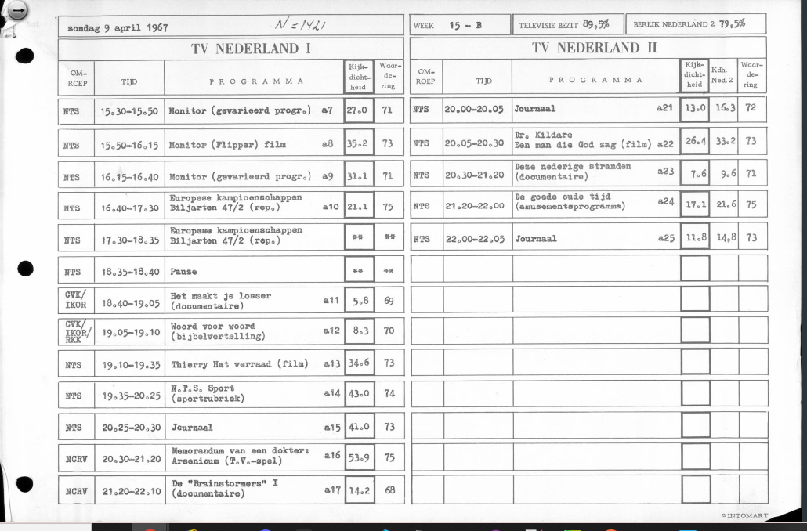
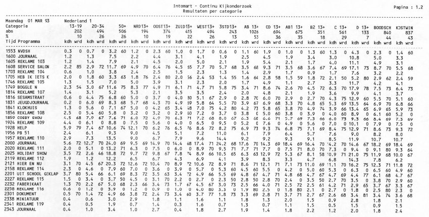

Tim Manders (Beeld en Geluid), Mari Wigham (Beeld en Geluid)

### Vraag het aan het archief
<iframe src='https://flo.uri.sh/visualisation/12731392/embed' title='Interactive or visual content' class='flourish-embed-iframe' frameborder='0' scrolling='no' style='width:100%;height:600px;' sandbox='allow-same-origin allow-forms allow-scripts allow-downloads allow-popups allow-popups-to-escape-sandbox allow-top-navigation-by-user-activation'></iframe>

<iframe src='https://flo.uri.sh/visualisation/12731359/embed' title='Interactive or visual content' class='flourish-embed-iframe' frameborder='0' scrolling='no' style='width:100%;height:600px;' sandbox='allow-same-origin allow-forms allow-scripts allow-downloads allow-popups allow-popups-to-escape-sandbox allow-top-navigation-by-user-activation'></iframe>

Het Beeld en Geluid archief bevat meer dan 2 miljoen items, verspreid over meer dan 150 jaar. Dat representeert een enorme schat van kennis, die gebruikers willen raadplegen. 
Het vaakst gaat het om een zoekvraag - gebruikers willen materiaal kunnen vinden in het archief. 
Bijvoorbeeld, alle materiaal van Andre van Duin.
Soms gaat het om een onderzoeksvraag. Bijvoorbeeld, hoeveel materiaal is al gedigitaliserd, hoe vaak valt het woordt 'klimaat' tijdens actualiteitenprogramma's, welke politici komen het vaakst aan het woord.
In principe, zou het archief in staat moeten zijn om zulke vragen te beantwoorden. Maar toch is het vaak lastiger dan verwacht, of zelfs onmogelijk - door metadatabreuken.

### Wat zijn metadatabreuken?

Metadata zijn data die een archief item beschrijven. Zonder die beschrijvingen is het nagenoeg onmogelijk om iets te zoeken in het archief. Metadata zijn de lens door wie we het archief kunnen zien.
Metadata hebben veel verschillende bronnen. Metadata kunnen vastgelegd worden door de makers van een programma, bijvoorbeeld de programmatitel en een 
samenvatting. Metadata kunnen later handmatig toegevoegd worden, bijvoorbeeld als een archivist een programma bekijkt en het beschrijft. Metadata kunnen automatisch ontstaan, bijvoorbeeld de datum en tijd 
waarop een bestand is geupload. En metadata kunnen geextraheerd worden uit audiovisueel materiaal en bestaande metadata, bijvoorbeeld door personen te herkennen uit beeld of in de beschrijving. Elke metadatabron
heeft zijn eigen karakteristieken. Een programmamaker legt dingen anders vast dan een archivist, en al helemaal anders dan een AI algoritme. Verschillen in hoe metadata is vastgelegd noemen we metadatabreuken.
Deze breuken zijn als krassen over onze metadata lens. Die introduceren blinde vlekken en distorties in onze blik op het archief.

### Wat veroorzaakt metadatabreuken?
#### Selectie van materiaal
Het meest fundamenteel verschil in metadata is - is een item in het archief wel of niet? Een archief bewaart niet alles. Er wordt een keuze gemaakt over welk materiaal wel of niet wordt bewaard. Deze keuze heet 
'selectie'. Bijvoorbeeld, Beeld en Geluid bewaart alleen televisieprogramma's die zijn gemaakt in Nederland. Buitenlandse programmering belandt niet in het archief. Een item dat niet in het archief is,
heeft vervolgens ook geen metadata. Dit lijkt een open deur. Echter, voor een gebruiker die niet weet hoe selectie is gedaan, kan het enorm verwarrend en frustrerend zijn wanneer ze niet vinden wat ze zoeken.

#### Verschillende manieren van metadatering

Zoals al besproken, kunnen metadata op verschillende wijzen worden vastgelegd. Dat maakt uit voor de inhoud van de metadata, en ook de kwaliteit. Automatische technologie zoals AI heeft de potentie om veel
meer materiaal te beschrijven dan een archivist ooit handmatig zou kunnen doen, maar kan niet hetzelfde niveau halen qua kwaliteit. Zelfs binnen een bepaalde manier van metadateren, zijn er veel keuzes
die gemaakt kunnen worden. Bijvoorbeeld, hoe het wordt toegepast op verschillende soorten materiaal. Het heeft overduidelijk geen zin om automatische spraakherkenning toe te passen op een decorondewerp. 
Maar toepassing op programma's met veel muziek of buitenlandse talen kan ook minder zinvol zijn. Waar middelen beperkt zijn, kan bepaalde types materiaal voorrang krijgen,. Bijvoorbeeld, 
bij Beeld en Geluid is het mogelijk om gezichten te herkennen. Echter kost deze technologie best veel. Om deze reden wordt het alleen toegepast op bepaalde genres, zoals nieuws, en alleen op een geselecteerde
groep van mensen. Het gebruik van hulpmiddelen zoals een thesaurus heeft ook impact op de kwaliteit van metadata - bijvoorbeeld dat alle personen worden vastgelegd met een thesaurus term, zodat verschillen
in schrijfwijze van namen niet in de weg komen bij zoeken. Het beleid van een archief - welke manieren van metadatering ze kiezen en hoe ze die inzetten - maakt dus veel uit voor de metadata die wordt gecreeerd. Beeld en Geluid is ontstaan uit
 de fusie van omroep- film en wetenschappelijke archieven. Elk instituut bracht zijn eigen metadata mee, gemaakt met een eigen beleid. Elke bron van metadata bevatte zijn eigen databreuken,
en tussen de metadata van verschillende instituten bestaan ook metadatabreuken. 

***grafiek van onderwerpen per categorie****
 
 
#### Veranderingen over tijd heen
Beleid rondom metadatering verandert ook over de tijd heen. Selectiebeleid wordt aangepast, nieuwe manieren van metadatering worden ingevoerd, richtlijnen worden geupdatet. Bij elke verandering - ook als 
de verandering tot betere metadata leidt - onstaat er een nieuwe metadatabreuk.

In deze grafiek is het duidelijk dat nieuwer Beeld en Geluid materiaal veel minder onderwerp-informatie heeft dan ouder. Dit komt door de verandering van handmatige annotatie door archivisten naar gebruiker
van productiemetadata en automatische metadata.
<iframe src='https://flo.uri.sh/visualisation/11177596/embed' title='Interactive or visual content' class='flourish-embed-iframe' frameborder='0' scrolling='no' style='width:100%;height:600px;' sandbox='allow-same-origin allow-forms allow-scripts allow-downloads allow-popups allow-popups-to-escape-sandbox allow-top-navigation-by-user-activation'></iframe>

### Beeld en Geluid databreuken
Beeld en Geluid heeft een rijke geschiedenis, en daardoor ook een grote hoeveelheid databreuken. ***Tim: denk je dat we hier een kort geschiedenis met de belangrijke breuken moeten geven?***
Om inzicht te geven in de belangrijkste databreuken, hebben we deze op een tijdslijn beschreven. De tijdslijn bevat
drie elementen
#### Selectie
De Selectie elementen beschrijven belangrijke veranderingen in het selectiebeleid van Beeld en Geluid. Deze worden aangegeven op de tijdslijn met blauwe bolletjes. Regelmatige archiveren van
radio is begonnen in 1977, significant uitgebreid vanaf 1997, en sinds 2006 worden alle publieke radio zenders volledig gearchiveerd. Regelmatige archiveren van TV begon in 1990, en sinds 2006 worden
alle Nederlandse producties op TV gearchiveerd. Muziek is tussen 1997 en 2014 gearchiveerd.

#### Metadata
De Metadata elementen beschrijven belangrijke veranderingen in hoe metadata wordt gemaakt bij Beeld en Geluid. Deze worden aangegeven op de tijdslijn met gele bolletjes. In 1997 begonnen
alle documentalisten bij Beeld en Geluid met 1 catalogussysteem te werken over film, TV en radio. Consistentie werd verder bevorderd door het invoeren van de GTAA thesaurus in 2001, zodat
documentalisten termen uit de thesaurus gebruikten in plaats van zelf een term in te typen, eerst voor genres en onderwerpen, en vanaf 2004 voor personen, organisaties en locaties. Als de hoeveelheid materiaal door veranderingen in selectie groeide, verschuifde het beleid van weinig
materiaal selecteren voor bewaren en dat veel te beschrijven, naar meer materiaal selecteren voor bewaren en op verschillende niveaus van diepte beschrijven, om de beperkte annotatiekracht gericht in te zetten voor materiaal waar 
de prioriteit het hoogst leek. TV, die en kleinere hoeveelheid programma's had dan radio, was typisch in meer detail beschreven dan radio. 

<table style='table-layout:fixed;width:100%'>
<tr>
<td style='width:50%'></td>
<td style='width:50%'></td>
</tr>
<tr>
<td style='width:50%'>Een goed geannoteerd programma</td>
<td style='width:50%'>Het programma is ook in segmenten onderverdeeld, die in detail zijn geannoteerd</td>
</tr>
<tr>
<td style='width:50%'></td>
<td style='width:50%'></td>
</tr>
<tr>
<td style='width:50%'>Een radio-opname van tijdens de oorlog</td>
<td style='width:50%'>Een televisie-programma met minimale metadata</td>
</tr>
</table>

_Example of varying annotation levels_

Het start van de Media Management programma in 2012 luidde in een tijdperk van grote veranderingen 
in metadata, en vanaf 2015 werd handmatige annotatie sterk afgebouwd, en de voorkeur gegeven aan ophalen van metadata bij de programmamakers en door sprekerherkenning (vanaf 2015) en
gezichtsherkenning (vanaf 2019). 

#### Opschuddingen
Op sommige punten in het geschiedenis van Beeld en Geluid is er sprake van een 'opschudding', een veranderingen die grote gevolgen heeft voor selectie en metadata. Het invoeren van een nieuwe metadatabeheersysteem
in 1997, 2006 en 2018 zorgt telkens voor een opschudding. Het grootschalige digitaliseringsproject 'Beelden van de Toekomst' zorgde ook voor een aardverschuiving in de metadata door een grote
instroom van gedigitaliseerd materiaal. Opschuddingen worden aangegeven met paarse bollen
en verticale stippenlijnen waardoor de gevolgen voor Selectie en Metadata duidelijk zijn.

De tijdslijn brengt alle elementen samen. Hover met je muis over een bolletje om er meer over te lezen
<iframe src='https://flo.uri.sh/visualisation/11074865/embed' title='Interactive or visual content' class='flourish-embed-iframe' frameborder='0' scrolling='no' style='width:100%;height:600px;' sandbox='allow-same-origin allow-forms allow-scripts allow-downloads allow-popups allow-popups-to-escape-sandbox allow-top-navigation-by-user-activation'></iframe>

De tijdslijn vertelt niet het hele verhaal, omdat op ieder moment in tijd er ook verschillen zijn in hoe verschillende types materiaal worden behandeld. Bijvoorbeeld, in de tijdperk van handmatige annotatie
bestond er een prioritering waarbij archivisten sommige items diepgaand beschreven, en anders op een meer summier manier. ***Tim, wat zouden we hieraan kunnen doen?***

### Impact van databreuken
Metadata bepalen wat we zien van het archief. ***Tim: willen we de lens analogie weer gebruiken of liever niet?*** De databreuken staan ons dus in de weg bij gebruik van het archief.

#### Impact op zoeken
Selectie heeft het grootste impact op zoeken. Uiteraard kan een gebruiker niet vinden wat er niet is geselecteerd te bewaren in het archief. Echter weet de gebruiker dat niet, als ze niet bekend zijn met
het selectiebeleid. Ze zoeken iets en snappen niet waarom ze het niet vinden.
Metadata verschillen beinvloeden ook de vindbaarheid van items. Een item met een volledige beschrijving, een spraaktranscript en een lijst van personen, organisaties en locaties is veel makkelijker te vinden
dan een item met summiere informatie. ***Tim: zullen we hier een voorbeeld geven van een item met veel metadata en een item met weinig? Misschien iets van uit de week van de NL televisie als 'slecht' voorbeeld?***

Soms is de informatie er wel, maar veranderingen in metadatering maken het zoeken moeilijker. Kijk naar deze voorbeeld van zoeken op Dolf Jansen in ons archief. De effecten van archiefbeleid zijn duidelijk te merken
in hoe items worden gevonden. Eerst in vrije tekst beschrijving, daarna als thesaurus persoon, en recenter in stem- en gezichtsherkenning. Een gebruiker moet in al deze metadatavelden zoeken om zo veel mogelijk
zoekresultaten te krijgen. Als ze dat niet weten, vinden ze te weinig materiaal. 
<iframe src='https://flo.uri.sh/visualisation/12732532/embed' title='Interactive or visual content' class='flourish-embed-iframe' frameborder='0' scrolling='no' style='width:100%;height:600px;' sandbox='allow-same-origin allow-forms allow-scripts allow-downloads allow-popups allow-popups-to-escape-sandbox allow-top-navigation-by-user-activation'></iframe>

#### Impact op onderzoeken
De impact op onderzoeken is veel erger. Om conclusies te trekken, heb je het liefst een compleet plaatje. Waar dat niet mogelijk is, is het essentieel om de beperkingen te weten, om daar rekening mee te kunnen houden.
Bijvoorbeeld, een onderzoek naar welke politici spreken in de media zal alleen politici vinden waarvoor er een sprekermodel is. De onderzoeker moet beslissen of deze beperking acceptable is in hun onderzoek of niet.
Analyse van trends over de tijd heen worden erg bemoeilijkt door veranderingen in metadata. Bijvoorbeeld, onderwerpinformatie werd vroeger door archivisten vastgelegd, nu nauwelijks meer. Recent materiaal heeft dan vaak
wel ondertitels of een transcript waarbinnen er gezocht kan worden op een term, maar er is een aanzienlijk verschil tussen het voorkomen van het woord 'klimaat' in een transcript en de keuze van een archivist om een programma
te taggen met het thesaurusterm 'klimaat'. Onderzoekers die niet bewust zijn van deze factoren krijgen gewoon resultaten van hun analyses, daar komt geen foutmelding. Alleen kunnen deze resultaten vertekend zijn door de
metadatabreuken, waardoor de onderzoeker foute conclusies kan trekken. 

Naar aanleiding van 70 jaar televisie wilden we kijk- en luistercijfers analyseren om de meest populaire programma's te identificeren. Dit was echter onmogelijk. Kijk- en luistercijfers waren niet over de hele
periode heen beschikbaar. Binnen de periode waarvoor ze wel beschikbaar waren, waren er grote verschillen in de formaten van de data, en was het manier waarop kijken en luisteren werd geregistreerd veel veranderd.

<table style='table-layout:fixed;width:100%'>
<tr>
<td style='width:50%'></td>
<td style='width:50%'></td>
</tr>
<tr>
<td style='width:50%'>1967</td>
<td style='width:50%'>1993</td>
</tr>
</table>

_Voorbeelden van verschillende formaten van kijk- en luistercijfers_

### Hoe gaat Beeld en Geluid om met databreuken?
Deze verhaal is onderdeel van een initiatief van Beeld en Geluid om databreuken uit de geschiedenis in kaart te brengen en goed te beschrijven. Op deze wijze kunnen archiefgebruikers goed geinformeerd aan de slag met
het archief. Bewust zijn van databreuken geeft de kans om er goed mee om te gaan. Bijvoorbeeld door de juiste keuze te maken van welke metadatavelden te doorzoeken, of welke zoektermen te gebruiken. 

### Hoe ga *jij* om met databreuken?
Wil je beter kunnen zoeken in het archief? Goed snappen wat je wel en niet vindt, en hoe je daar rekening mee kan houden? Dan zijn de volgende stappen belangrijk:
- lees documentatie over de databreuken (dit verhaal is een goed begin)
- denk goed na over je zoek- of onderzoeksvraag. Welke metadata gebruik je? Over welke tijdsperiode? Welke databreuken spelen voor jou dan een rol?
- kijk of je de databreuken kan omzeilen - een andere metadataveld kiezen, een meer homogene subcollectie kiezen, je vraag aanpassen of compensatie toe te passen in je analyse?
- Media Suite tools gebruiken

De Media Suite heeft een Inspect tool waarmee je databreuken goed kunt opsporen. Ook is er een Compare tool waarmee je kunt compenseren voor breuken **voorbeeld Mediaoorlog**

### Conclusie
Databreuken zijn inherent aan een rijke archiefcollectie die over tijd steeds groeit en ontwikkelt. Als je er van bewust bent, kan je alsnog de beste halen uit de schat van het archief.
