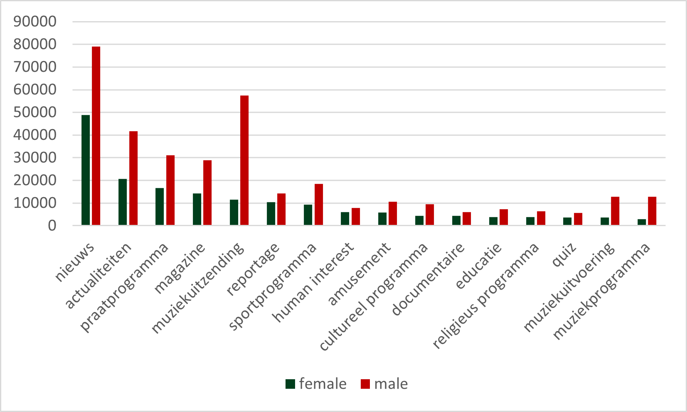
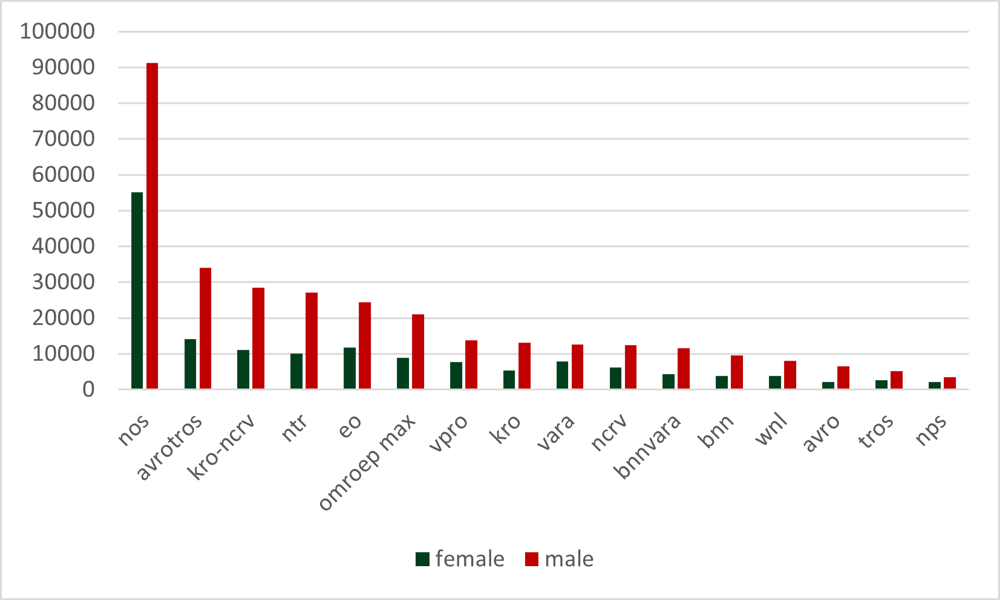
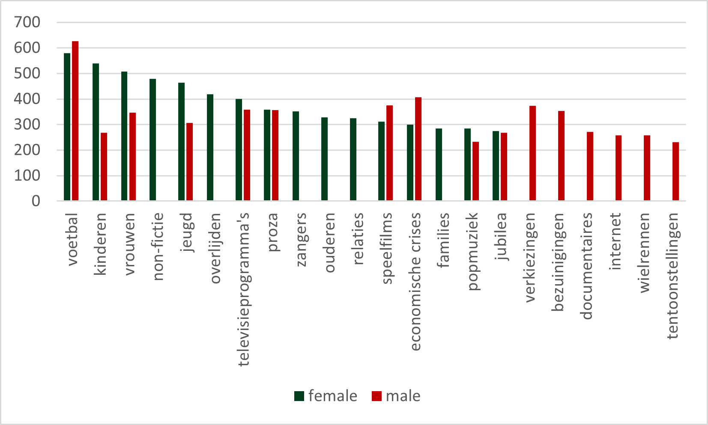

Willemien Sanders

This project will look into the presence in and contribution to Dutch news, current affairs and documentaries of female and male guests and participants. As a variety of individuals contribute to these non-fiction genres and thereby co-construct representations of our historical world, and as media representations play an important role in our own constructions of the world, it is important to understand who gets an opportunity to contribute to these constructions, and what they contribute.   

### 1.1	Initial exploration: searching in the database 

To get an idea of what is available in the Media Suite and to get an initial idea about the gender division in Dutch media, I started with a number of queries in the NISV collection. I then looked at several aspects of the results (facets). Below I discuss the preliminary findings.  

### 1.1	Simple and more complex initial queries
As my research interest concerns what women and men talk about in Dutch media, I reasoned that people who appear on radio and television are often introduced by pronouns. Therefore, first query consisted of a simple “meneer” or “de heer” (mr.) and “mevrouw” (mrs.) respectively. I used the NISV collection and limited my search to the period 2011-present, which was 3 November 2020. This resulted in a 9.203:391.437 ratio. The might of course well be due to the fact that I used one female noun and two male nouns. I realized that more complex queries were desirable, as there is a range of pronouns that could be used to introduce or refer to female and male guests. I included some in English as well, as sometimes foreign guests appear and in such cases English often is the preferred language. So, I continued with these two queries:

_Table 1. Queries with female and male pronouns_

| Gender        | pronouns           |
| ------------- |:-------------:| 
| Female      | zij OR haar OR mevrouw OR juf OR juffrouw OR she OR her OR ma'am OR miss OR mrs OR vrouw OR hers OR madam | 
| Male      | hij OR hem OR meneer OR heer OR "de heer" OR deheer OR mijnheer OR he OR him OR sir OR his OR mister OR mr | 

The result for the ‘female’’ query was 173.366 items, the result for the male query was 401.326 items, over twice as much. As the research covers the period 2011-2020, I executed this query again recently, and this provided the same numbers [^1].  

To further understand what this means, I looked at three facets: genre, broadcaster and key words. I will discuss these in turn below. 

### 1.2 Genre
Genre is one of the standard metadata fields offered in the Media Suite. Looking at the highest scoring genres for both female and male pronouns I noticed that in the first Top 18, there was an overlap between sixteen genres. Figure 1.1 shows the amount of female and male pronouns in these sixteen genres.

_Figure 1.1. Female and male pronouns in different genres._

The graph indicates that the male pronouns occur more that female pronouns in all of these genres. The female list additionally contained ‘televisiedrama’ (television drama), the male list also contained ‘vraaggesprek’ (interview).

### 1.3 Broadcasters
The seventeen highest scoring broadcasters for both genders also mostly overlapped, and the graph below shows the sixteen broadcasting companies appearing in both lists. 

_Figure 1.2. Female and male pronouns for different broadcasters._

Again, the male pronouns systematically score higher than the female ones. The broadcaster listed in the male list Top 17 that did not occur in the female list is Funx; the one in the female list that did not occur I the male list was RKK. 

### 1.4 Key words
To get an idea about the pronouns in relation to content, I selected and added the facet ‘key words’ to the interface. This time, there was considerably less similarity between the male and female lists. The graph below again shows the sixteen highest scoring results for both genders. 

_Figure 1.3. Female and male pronouns and key words._

A quick look at these results suggests that the female pronouns are related more to topics related to people and generations and male pronouns to topics related to business and technology. Both score high on ‘voetbal’ (soccer) though. One explanation might be than the Dutch female soccer team has been quite successful in recent years and that soccer is a popular topic anyway. 

The preliminary findings presented here invite further research, not only into the differences between female and male presence in Dutch media but also into the Media Suite as a resource. In the next weeks, further analyses of metadata and ASR files will be conducted and discussed here to see who are speaking and who are spoken about, and how this might be investigated. 

[^1]: These number will increase in the future as more programmes will be submitted to Automatic Speech Recognition (ASR). 
