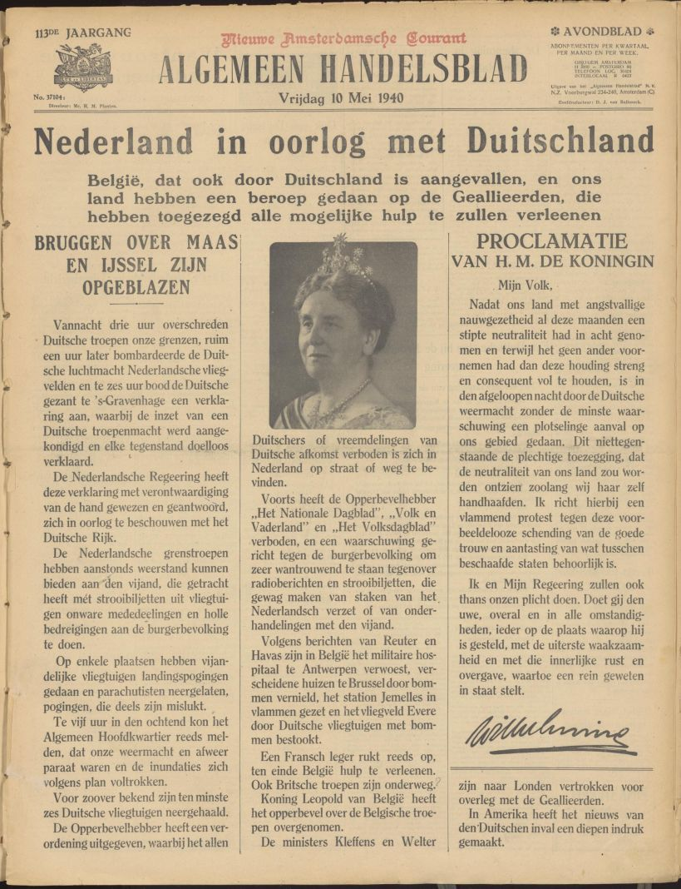

### Inleiding en methodologie

De bezetting van Nederland tijdens Tweede Wereldoorlog was in veel opzichten een unieke periode in de moderne nationale geschiedenis. Alle aspecten van het maatschappelijke leven werden diep beïnvloed -  zo ook de media in die tijd, zoals krant en radio. Zowel voorstanders als tegenstanders van de bezetting gebruikten deze media om mensen te mobiliseren voor hun politieke doeleinden. Zo werd Nederland een belangrijk slagveld in de propagandaoorlog tussen nazi-Duitsland en Groot-Brittannië. Er is veel historisch onderzoek gedaan naar verschillende aspecten van de Nederlandstalige propaganda maar deze publicaties beperken zich vooral tot de institutionele aspecten van het medialandschap. Tot nu toe mist een integrale inhoudelijke analyse van de mediabronnen uit de Tweede Wereldoorlog.

Het project [MediaOorlog](https://beeldengeluid.nl/kennis/projecten/mediaoorlog) analyseert de dynamiek van de propaganda in de Nederlandse oorlogsmedia en neemt daarbij als uitgangspunt de mediabronnen zelf. Door digitalisering zijn dit soort bronnen de afgelopen jaren op grote schaal doorzoekbaar geworden , waardoor het mogelijk is voor onderzoekers om zicht te krijgen op semantische patronen  en zo te visualiseren wanneer bepaalde woorden werden gebruikt in de oorlogsmedia. De nadruk van dit onderzoeksproject ligt vooral op de interactie tussen de verschillende kampen in de propagandastrijd: de media die de nazi-bezetting van Nederland steunden en de media die zich daartegen verzetten.

Een belangrijke collectie voor dit onderzoek is de [online databank Delpher](https://www.delpher.nl/oorlogskranten/) die een grote hoeveelheid gedigitaliseerd krantenmateriaal bevat, ook uit de bezettingsperiode (10 mei 1940 t/m 5 mei 1945). Het gaat om ruim 130.000 kranten uit deze periode, die zijn gesegmenteerd in 6.942.721 artikelen. 

<iframe src='https://flo.uri.sh/visualisation/11870011/embed' title='Interactive or visual content' class='flourish-embed-iframe' frameborder='0' scrolling='no' style='width:100%;height:600px;' sandbox='allow-same-origin allow-forms allow-scripts allow-downloads allow-popups allow-popups-to-escape-sandbox allow-top-navigation-by-user-activation'></iframe>

_Figuur 1: aantal artikelen over tijd_

Deze Data Story belicht de manier waarop het team van MediaOorlog deze enorme datacollectie van Delpher heeft ontsloten in de CLARIAH Media Suite om hun onderzoek te kunnen verrichten .  Zoals zal blijken was dit een complex proces waarbij bepaalde keuzes zijn gemaakt. Deze Data Story heeft als doel om inzicht te geven in dit proces. 

Wij denken dat dit verhaal relevant is op twee manieren. Ten eerste reflecteert deze Data Story op het ontsluiten van een groot corpus aan gedigitaliseerde historische data en in die hoedanigheid kan het dienen als een voorbeeld voor andere projecten. Ten tweede geven we rekenschap van de omgang met een bronnencorpus uit een van de meest beladen periodes uit de Nederlandse geschiedenis: de nazi-bezetting tijdens de Tweede Wereldoorlog. In het onderzoek, dat inmiddels verricht is door onderzoek-fellows blijkt dat collectie oorlogskranten een zeer rijke bron is en we hopen met deze Data Story anderen te inspireren om eigen onderzoek te verrichten en  nodigen iedereen uit om gebruik te maken van deze dataset.

<table>
<tr>
<td></td>
<td></td>
</tr>
<tr>
<td><i>Algemeen Handelsblad</i>, 10 mei 1940</td>
<td><i>Het Parool</i>, 5 mei 1945</td>
</tr>
</table>

_Afbeelding 1: voorpagina’s van twee kranten die het begin- en eind markeren van de periode die wordt onderzocht_

Deze Data Story is de uitkomst van een intensieve samenwerking tussen mensen die werken in verschillende disciplines: data engineering, AI development en geschiedenis. Het proces was in veel opzichten een vruchtbare dialoog tussen kwalitatieve en kwantitatieve onderzoeksmethodologiën, die elkaar goed aanvullen. Aan de ene kant valideren kwantitatieve trends in de data enkele belangrijke punten in de bestaande historische literatuur over de Nederlandse media tijdens de Tweede Wereldoorlog. Aan de andere kant kan kwalitatief historisch onderzoek helpen om de beschikbare data te verifiëren en waar nodig te corrigeren. Het eerste deel van deze Data Story geeft inzicht in deze interdisciplinaire samenwerking. Daarnaast toont deze bijdrage aan dat de beschikbare data in de Media Suite mogelijkheden biedt voor nieuw mediahistorisch onderzoek. In het tweede deel laten we zien hoe met behulp van verschillende strategieën semantische patronen kunnen worden blootgelegd die onze kennis over het gebruik van media voor propagandadoeleinden tijdens oorlogstijd kunnen verdiepen. Uitgangspunt hierbij is om de wisselwerking bloot te leggen tussen de propaganda-narratieven in media die de bezetting steunden en de media die zich daartegen verzetten.

### 2. Categorisering mediabronnen: genazificeerd en anti-nazi

De metadata-velden van de krantencollectie Delpher kennen verschillende categorieën, die inzicht geven in de aard van de publicaties. Wat ontbreekt is een indeling op redactioneel-politieke gronden.  Als het gaat om kranten uit de Tweede Wereldoorlog is het van groot belang om een indeling te maken langs politieke lijnen om tot een goede analyse van de bronnen (bronnenkritiek) te komen . De belangrijkste scheidslijn was die tussen de publicaties die onder controle stonden van de bezettingsautoriteiten, en dus informatie verspreidden die het regime ondersteunde, en publicaties die opriepen tot verzet. Deze eerste categorie ‘genazificeerde kranten’ kan verder onderverdeeld worden. Er waren kranten die werden uitgegeven door organisaties verbonden met de ‘nazi partij’ die het regime vrijwillig  en uit overtuiging steunden. Daarnaast waren er kranten die ‘gelijkgeschakeld’ waren en onder strikt toezicht stonden van bezettingsautoriteiten, die veel druk uitoefenden op de journalisten die werkzaam waren bij deze kranten. De ‘anti-nazi kranten’ in bezet Nederland verschenen clandestien omdat uitgave ‘illegaal’ was, een term die zij als geuzennaam adopteerden. In september 1944 werden de zuidelijke provincies van Nederland ‘bevrijd gebied’ en ook daar verschenen kranten die ageerden tegen de nazi’s.

Op basis van deze inzichten uit de bestaande historiografie zijn categorieën geformeerd om de metadata van het Delpher materiaal te verrijken. Met name waardevol was de publicatie [_Woord als wapen_](http://publications.niod.knaw.nl/publications/Woord_wapen.pdf) uit 1952, dat een overzicht bevat van de verzetskranten die zijn gearchiveerd door het Rijksinstituut voor Oorlogsdocumentatie (thans NIOD Instituut voor Oorlogs-, Holocaust- en Genocidestudies). Met behulp van een lijst van 1273 titels is handmatig een indeling gemaakt in een excel sheet, die is gebruikt om in de Media Suite selecties (zogeheten _queries_) te maken zodat onderzoekers de verschillende segmenten van het krantenlandschap in samenhang kunnen onderzoeken en vergelijken met behulp van de compare-functie. De hyperlinks hieronder geven toegang tot de verschillende _queries _en kunnen voor eigen doeleinden worden opgeslagen door ingelogde gebruikers van de Media Suite en gebruik voor eigen onderzoek.

**[Hele corpus (alle krantentitels 10 mei 1940 t/m 5 mei 1945)](https://mediasuite.clariah.nl/tool/single-search?queryId=15710a10-1c6d-4c3c-bbb7-73b2c12784c9)**

**Genazificeerd**

* [Gelijkgeschakelde kranten](https://mediasuite.clariah.nl/tool/single-search?queryId=00209676-3f99-4440-8f26-8ba126bd08fc) (118 titels, 6.096.506 artikelen)
* [Nazi-partij kranten](https://mediasuite.clariah.nl/tool/single-search?queryId=af151df4-7399-4589-80d3-52e956ffa98d) (21 titels, 475.630 artikelen)

**Anti-nazi**

* [Illegale pers](https://mediasuite.clariah.nl/tool/single-search?queryId=c1c842dd-b3d5-431b-a542-083d5a7e76a0) (955 titels, 269.089 artikelen)
* [Bevrijd gebied](https://mediasuite.clariah.nl/tool/single-search?queryId=ed256a74-d65c-4cf8-a56d-e02e9fa9ff1c) (157 titels, 60.592 artikelen)

Tijdens het categoriseren, en ook in het onderzoek daarna, viel het op dat sommige titels in meerdere categorieën passen. Deze zijn gezet in een aparte restcategorie [‘onbekend’](https://mediasuite.clariah.nl/tool/single-search?queryId=ab65ffd3-a043-404c-b750-1a5afb8196d5) (22 titels, 40.904 artikelen).  Zulke categoriseringsproblemen hebben verschillende oorzaken. Een daarvan is dat de historische omstandigheden veranderden. Zo zijn sommige kranten die in het zuiden van Nederland verschenen zowel in te delen in de categorie ‘gelijkgeschakeld’ als in de categorie ‘bevrijd gebied’ (vanaf september 1944). Een voorbeeld is het in Maastricht gepubliceerde katholieke blad _Veritas_.

      5 mei 1941 (gelijkgeschakeld)        25 september 1944 (bevrijd gebied)

Afbeelding 2: twee versies van _Veritas_ ‘gelijkgeschakeld’ (links) en ‘bevrijd gebied’ (rechts)

Een andere factor was de dynamiek van de propagandastrijd. Sommige titels van nazi-partij kranten werden gebruikt door verzetsgroepen. Deze vorm van imitatie was waarschijnlijk bedoeld om nationaal-socialisten te desoriënteren. Een voorbeeld is _Storm: Blad der Nederlandsche SS_ dat, op niet echt overtuigende wijze, werd nagemaakt in Amsterdam in de laatste dagen van de bezetting.

    25 april 1941	_				_29 april 1945

Afbeelding 3: twee versies van Storm SS: de originele nazistische versie (links) en de imitatie door het Amsterdamse verzet (rechts)

 

### 3. Ongelijk medialandschap

Om tot een goede afweging te komen van de betekenis van de verschillende publicaties tijdens de Tweede Wereldoorlog, is het van belang om te beseffen dat het medialandschap in die jaren ongelijk was. Het autocratische bezettingsregime in Nederland liet geen vrijheid van meningsuiting toe en had als doel om via de kranten de Nederlandse publieke opinie te winnen voor Hitler’s Derde Rijk. Bladen die werden uitgegeven door de NSB of andere nationaal-socialistische organisaties, deden dit vanuit ideologische overtuiging en waren open doorgeefkanalen voor de nazi-propaganda uit Berlijn. Deze kranten bevatten extremistische uitingen, zoals een virulent antisemitisme.[^1] Wat jodenhaat betreft, spande het weekblad _De Misthoorn _de kroon.

_      De misthoorn_, 5 september 1942

Afbeelding 4: een voorbeeld van antisemitisme in het kranten-materiaal

Bestaande kranten van andere politieke signatuur mochten blijven bestaan maar werden onder strikte controle gesteld (gelijkgeschakeld), door middel van censuur en ‘vertrouwelijke mededelingen’, richtlijnen die elke dag werden uitgedeeld tijdens een persconferentie.[^2] Na de bevrijding, in 1945, verbeeldde de cartoonist Leo Jordaan dit _top-down _informatiesysteem op iconische wijze:

Afbeelding 5: cartoon Leo Jordaan over de gelijkgeschakelde kranten (1945)

bron: [https://geheugen.delpher.nl/nl/geheugen/view?identifier=EVDO02%3ANIOD05_7999](https://geheugen.delpher.nl/nl/geheugen/view?identifier=EVDO02%3ANIOD05_7999).

Maar de bezettingsautoriteiten gebruikten niet alleen dwangmiddelen om journalisten te bewegen om de gewenste artikelen te plaatsen in hun kranten. Ze gebruikten ook verleiding. Zo werden de arbeidsomstandigheden van journalisten aanzienlijk verbeterd door middel van wetgeving. Ook werden er zomerkampen georganiseerd in Kasteel Cannenburgh, waar het Nederlandse journaille op ontspannen wijze kon kennismaken met kopstukken van de bezettingsautoriteiten. Zie deze [propagandafilm](https://mediasuite.clariah.nl/tool/resource-viewer?id=oai:openimages.eu:1128181&cid=open-beelden-beeldengeluid&st=%22EERSTE%20NEDERLANDSE%20JOURNALISTENKAMP%20OP%20DE%20CANNENBURGH%20TE%20VAASSEN%22) uit 1941. 

De omgang met de verzetskranten was totaal anders. Medewerkers van illegale bladen werden zeer streng vervolgd door de bezettingsautoriteiten, die actief jacht maakten op de faciliteiten van de ondergrondse pers om zo te voorkomen dat deze kranten in omloop kwamen. Bovendien waren de straffen zeer streng en er zijn dan ook veel illegale journalisten, drukkers en bezorgers ter dood gebracht voor het vuurpeloton of in concentratiekampen: de erelijst van gevallenen telt 777 namen.[^3] Het werken onder absolute geheimhouding maakte het moeilijk om kranten te maken en te distribueren. Veel kranten werden dan ook lokaal gemaakt en verspreid door aparte redacties, om de pakkans zo veel mogelijk te verkleinen. Dit verklaart waardoor 97,9% van de kranten in de categorie ‘illegaal’ is gecategoriseerd als regionaal/lokaal, tegenover 68,1% in ‘gelijkgeschakeld’. Grotere verzetsgroepen die zich bezighielden met de illegale pers werkten dan ook vaak met lokale redacties, waardoor er verschillende edities ontstonden. Zo bevat de Delpher dataset 40 verschillende uitgaves van het protestantse verzetsblad _Trouw_, dat werd opgericht in de eerste maanden van 1943.

Deze contrasten, voortgekomen uit de machtsongelijkheid van de bezettingsperiode, vertalen zich in de kwantitatieve data: de gelijkgeschakelde kranten tellen veruit de meeste artikelen. Om dit te kunnen uitbeelden hebben we visualisaties gemaakt van de aantallen krantenartikelen per categorie. De Media Suite biedt de mogelijkheid voor dit soort analyses niet, omdat deze specifiek zijn per onderzoeker. Naast de Media Suite wordt er daarom een omgeving opgezet waarin de data geanalyseerd kan worden via Jupyter Notebooks, een laagdrempelige manier voor onderzoekers om aan de slag te gaan met data en visualisaties. Deze omgeving is nu alleen binnen het online domein van Beeld en Geluid beschikbaar maar zal binnenkort breder toegankelijk worden gemaakt.

Figuur 2: totaal aantal artikelen per categorie

### 4. Ontwikkeling over tijd: afname van genazificeerde kranten, groei anti-nazi kranten

De ongelijkheden in het medialandschap waren niet constant tijdens de gehele bezetting. Zoals figuur 3 laat zien, kalfde de gelijkgeschakelde pers af tijdens de periode 1940-1945 en groeide de illegale pers. In de laatste maanden van de oorlog bevat het corpus zelfs meer materiaal uit de illegale pers dan uit de genazificeerde pers.

Figuur 3. Aantal artikelen per categorie kranten, over tijd. 

Deze trends zijn te verklaren met behulp van de bestaande literatuur. Ten eerste is aangetoond dat de bezettingsautoriteiten steeds strenger werden en in de loop van de oorlog meer kranten verboden (soms tijdelijk, soms permanent), waardoor er in de loop van de tijd minder gelijkgeschakelde titels verschenen.[^4] Aan de andere kant werden de illegale bladen steeds beter georganiseerd. Waar in de eerste maanden individuen veelal alleen werkten, ontstonden er later tijdens de bezetting steeds uitgebreidere netwerken die de productie van bladen faciliteerden. Een belangrijke impuls voor de groei van de illegale pers was het verbod op radio-ontvangst toestellen in mei 1943. Dat verbod werd door de bezettingsautoriteiten ingevoerd om te voorkomen dat mensen luisterden naar zenders die vanuit Londen uitzonden. Verzetsgroepen in verschillende steden namen daarom het initiatief om illegale bladen te maken op basis van die radio-uitzendingen, zodat mensen er toch kennis van konden nemen, zonder dat zij het risico hoefden te nemen om een radio in huis te hebben.[^5] De radiozenders uit Londen waren zich bewust van deze praktijken en maakten in de laatste fase van de oorlog speciale uitzendingen op dicteer-snelheid zodat de Nederlandse verzetsmensen de berichten goed konden overtypen, zoals te horen is in dit [audiofragment](https://mediasuite.clariah.nl/tool/resource-viewer?id=2101608150134284931&cid=daan-catalogue-aggr&bodyClass=noHeader&singleResource=1). Veel titels van illegale bladen verwezen naar de Britse zenders, zoals de _Hier is Londen!_, en _B.B.C. Nieuws_.

    _Hier is Londen!_, 28 oktober 1944  	_B.B.C._ _Nieuws_, 27 december 1944.

Afbeelding 6: krantentitels die verwijzen naar de radio-uitzendingen uit Londen

Er is ook een materiële verklaring voor de dalende trend in de genazificeerde pers en de opgaande trend in de anti-nazi pers. Verzetsgroepen werden steeds succesvoller in het stelen van papier en inkt, zodat zij steeds meer middelen kregen om hun kranten te maken, terwijl de toegestane kranten met steeds grotere schaarste werden geconfronteerd. Daarnaast kregen de redacties van verzetsbladen ook steeds meer toegang tot professioneel materieel om hun drukwerk te maken.[^6] Zo werd de Amsterdamse editie van het illegale blad _Het Parool_ na sluitingstijd gedrukt op de burelen van de gelijkgeschakelde krant _De Telegraaf_. _Het Parool_, dat zijn oorsprong had in _De Nieuwsbrief van Pieter ‘t Hoen,_ zag er daardoor ook steeds professioneler uit. Deze ontwikkeling in layout bevestigt de grafieken met de kwantitatieve data trends.

.

Afbeelding 7: _Nieuwsbrief van Pieter ’t Hoen_, 25 juli 1940 en_ Het Parool_, 10 mei 1941, 10 mei 1942 en 5 mei 1945. De vormgeving werd steeds professioneler. 

### 5. Geografische termen: onderzoek met Named Entity Recognition (NER)

De bestaande literatuur over de oorlogsmedia richt zich sterk op de Nederlandse nationale context. Het project Mediaoorlog probeert aandacht te vragen voor de transnationale context van de propagandastrijd in de Nederlandstalige media. Onze hypothese is dat het Nederlandse medialandschap gezien kan worden als een slagveld van de twee machtsblokken die tegenover elkaar stonden in Europa: de asmogendheden en de geallieerden. Om dat te onderzoeken, hebben we gekeken naar alle voorpagina’s in de krantendataset. Het uitgangspunt hierbij is dat dit deel van een krant het meest belangrijke nieuws bevat. Ook was het, in de tijd die we onderzoeken, niet gebruikelijk om advertenties op de de voorpagina te plaatsen, zodat deze data vooral bestaat uit prominent en ‘hard’ nieuws.

Deze krantendataset bestaat uit ingescande voorpagina’s waaruit met behulp van optische tekenherkenning (OCR, optical character recognition) de tekst is geëxtraheerd. Vervolgens is eigennamen-extractie (NER, named entity recognition) gebruikt om de geopolitieke context in kaart te brengen. Op deze manier kunnen zowel de verschillende spellingsvarianten zoals Duitsland/Duitschland als  varianten zoals Duitachland en Duitsohland, die ontstaan zijn door OCR fouten, worden geïdentificeerd (zie afbeeldingen 8 t/m 11). Omdat het gebruikte algoritme niet alle geografische termenherkent (precision 0.78, recall 0.76, F-score 0.77) hebben we de meest voorkomende geografische termen (inclusief spelling variaties) vervolgens gezocht en geteld.

Afbeelding 8: ‘Duitşland’, bron: _Het Volk_, 06-06-1940 [https://www.delpher.nl/nl/kranten/view?coll=ddd&identifier=ddd:011117564:mpeg21:a0052](https://www.delpher.nl/nl/kranten/view?coll=ddd&identifier=ddd:011117564:mpeg21:a0052)

Afbeelding 9: ‘Duitschland’, bron: _Zutphensche Courant_, 06-06-1940 [https://www.delpher.nl/nl/kranten/view?coll=ddd&identifier=ddd:010695301:mpeg21:a0077](https://www.delpher.nl/nl/kranten/view?coll=ddd&identifier=ddd:010695301:mpeg21:a0077) 

Afbeelding 10: ‘Duitachland’, bron: _Residentiebode_, 04-10-1941 [https://www.delpher.nl/nl/kranten/view?coll=ddd&identifier=ddd:011062607:mpeg21:a0212](https://www.delpher.nl/nl/kranten/view?coll=ddd&identifier=ddd:011062607:mpeg21:a0212) 

Afbeelding 11: ‘Duitsohland’, bron: _Het nieuws_, 21-03-1945 [https://www.delpher.nl/nl/kranten/view?coll=ddd&identifier=ddd:010431700:mpeg21:a0002](https://www.delpher.nl/nl/kranten/view?coll=ddd&identifier=ddd:010431700:mpeg21:a0002)

Om de spellingsvarianten mee te nemen hebben we deze geclusterd voor een aantal belangrijke geografische termen , bepaald aan de hand van een eerste inventarisatie van de frequenties van alle spellingsvarianten. 

Figuur 4. Grafiek met uitkomsten NER-analyse geografische termen voorpagina’s. [https://public.flourish.studio/visualisation/9972759/](https://public.flourish.studio/visualisation/9972759/) 

Figuur 4 laat zien dat het Nederlandse medialandschap tijdens de Tweede Wereldoorlog gericht was op de internationale context. Met name de strijd tussen nazi-Duitsland en het laatste bastion van de geallieerden, Engeland, in Noordwest Europa was vaak voorpagina-nieuws. Het feit dat de twee hoofdsteden van deze landen, Berlijn en Londen, op plekken 5 en 6 staan, onderstreept deze dynamiek. In de huidige literatuur wordt de geschiedenis van de kranten tijdens de Nederlandse bezetting nog vaak in strikte nationale context bezien.[^7] Deze visualisatie laat echter zien dat het Nederlandse medialandschap in transnationaal perspectief geplaatst moet worden. Via de geschreven pers hadden Nederlanders toegang tot informatie over de gebeurtenissen buiten de grenzen die het lot van hun eigen land in grote mate bepaalden. Die informatie was niet neutraal en lezers waren zich hiervan bewust, zoals blijkt uit egodocumenten die zij achter hebben gelaten.[^8] Bovendien, als we naar de NER diagrammen kijken van afzonderlijke categorieën, zien we interessante verschillen in de top 4. Een nadere blik op deze uitkomsten roept nieuwe reflecties op.

Vanwege het grote aantal locaties was clustering niet haalbaar voor alle geografische termen; , dus dit is alleen gedaan voor een beperkt aantal termen die in deze inventarisatie naar voren kwamen. Deze analyse van het hele corpus voorpagina’s laat zien dat vier geografische termen duidelijk meer genoemd worden dan anderen:

1. Engeland
2. Duitsland
3. Nederland
4. Europa

#### Europa domineert in Nazi-partij kranten

Figuur 5. Uitkomsten NER analyse geografische termen voorpagina’s voor de categorie nazi-partij kranten. [https://public.flourish.studio/visualisation/9972939/](https://public.flourish.studio/visualisation/9972939/) 

Een van de uitkomsten van de NER-analyse is dat ‘Europa’ de meest voorkomende geografische aanduiding is op de voorpagina’s van de nazi-partijkranten. Hoewel Hitler uitsluitend geïnteresseerd was in het belang van Duitsland, maakten de nazi’s, vooral in hun propaganda gericht op de bezette gebieden, veelvuldig gebruik van het ideaal ‘Europa’ om hun oorlogsdoelen en bezettingspolitiek te legitimeren. De wijze waarop door de nazi-autoriteiten en hun collaborateurs invulling werd gegeven aan ‘Europa’ was echter divers, veranderlijk, soms conflicterend en dikwijls vaag. Na capitulatie van Frankrijk in juni 1940 promootten de nazi’s een toekomstige, nieuwe orde in Europa, die gekenmerkt zou worden door een behoud van nationale eigenheden, autarkie, vrede en welvaart en gecontrasteerd werd met het Verenigd Koninkrijk als imperialistische macht die slechts uit was op chaos en verdeeldheid op het Europese continent. De nazi-plannen voor deze nieuwe Europese orde in vredestijd waren het meest concreet op het gebied van de economie en kregen onder andere gestalte in het door de Duitse minister van Economische Zaken, Walther Funk, in juli 1940 gelanceerde plan voor een Europese betalingsunie. 

Met de inval van de Sovjet-Unie op 22 juni 1941 kreeg het idee van Europa voor de nazi’s een nieuwe urgentie. De oorlog tegen het ‘Aziatische bolsjewisme’ werd door Hitler en Goebbels voorgesteld als een gemeenschappelijke Europese kruistocht voor een nieuw Europa en het behoud van de Europese beschaving. Ook op radio Hilversum en in de Nederlandstalige gelijkgeschakelde pers en nazi-partij kranten werd deze voorstelling van een strijd van en voor het nieuwe Europa, tegen het anti-Europese Sovjet-bolsjewisme en de Britse (en vanaf december 1941 Brits-Amerikaanse) plutocratie, voortdurend aangehaald. Een voorbeeld is het onderstaande artikel van Anton Mussert op de voorpagina van het NSB partijblad _Volk en Vaderland_, waarin de NSB-leider, een dag na het begin van de Duitse inval, de oorlog tegen de Sovjet-Unie prijst als “het eenige middel dat mogelijk is om een nieuw Europa te bouwen”. 

Afbeelding 12: voorpagina _Volk en Vaderland_, 23 juni 1941, over de Duitse aanval op de Sovjet-Unie

#### Nederland domineert in illegale pers

Figuur 6. Uitkomsten NER analyse geografische termen voorpagina’s voor de categorie illegale kranten. [https://public.flourish.studio/visualisation/9973014/](https://public.flourish.studio/visualisation/9973014/) 

In de illegale pers is het trefwoord ‘Nederland’ de meest voorkomende geografische term. Deze nadruk laat zich verklaren doordat de auteurs in deze categorie kranten met name bezig waren met de bestrijding van het nazi-bezettingsregime in eigen land. Dit kan ook verklaren waarom ‘Duitsland’ en ‘Berlijn’ ook hoog scoren. Een belangrijke bron voor inspiratie voor dit verzet was het nationale verleden, met name de vrijheidsstrijd tegen Spanje tijdens de Tachtigjarige Oorlog, die vaak werd aangehaald als voorbeeld voor de twintigste-eeuwse ‘geuzen’ die het nazisme bestreden. 

In de laatste twee jaar van de oorlog, toen steeds duidelijker werd dat het Hitler-regime het onderspit zou delven tegen de geallieerden, functioneerden de illegale kranten bovendien als belangrijke fora voor discussies over de toekomst van Nederland na de bevrijding.[^9] _Vrij Nederland_ was de titel van een van de meest bekende verzetsbladen maar dit waren ook gevleugelde woorden die het opkomende optimisme over de eindoverwinning van de geallieerden tot uitdrukking brachten. De focus op Nederland in de illegale pers kan ook een van de redenen zijn waarom in de naoorlogse literatuur zoveel nadruk lag op de nationale context van de bezettingsgeschiedenis. Zoals vaker in het verleden werd ook in Nederland de geschiedenis geschreven door de overwinnaars. Veel journalisten die voor de illegale pers hadden geschreven, werden prominente stemmen in het historische debat over de Tweede Wereldoorlog.

Afbeelding 13: _Ons Vrije Nederland_, 29 April 1945, naar aanleiding van de aanstaande bevrijding van Nederland

### 6. Trefwoorden

Een andere strategie waarmee we in het project MediaOorlog hebben gewerkt is het uitvoeren van _keyword searches _om inzicht te krijgen in de semantische patronen in het Nederlandse gedigitaliseerde krantenmateriaal uit de Tweede Wereldoorlog. In deze strategie neemt de onderzoeker niet automatisch gegenereerde data-patronen als uitgangspunt maar zelf-geformuleerde trefwoorden die zijn gebaseerd op haar/zijn inzichten uit de bestaande literatuur. Om deze methode werkbaar te maken, gezien de grote hoeveelheid data, gebruiken de onderzoekers de _compare_-functie in de Media Suite, waarin verschillende trefwoord-_queries _met elkaar kunnen worden vergeleken. Op deze manier kunnen onderzoekers semantische patronen over de tijd heen zichtbaar maken en momenten selecteren die nader kunnen worden onderzocht. In de _compare-functie_ van de Media Suite is het mogelijk een selectie van artikelen te bekijken en daarna door te klikken naar het oorspronkelijke gedigitaliseerde materiaal op de website van Delpher, waar het materiaal nader kan worden onderworpen aan historische bronnenkritiek. De ervaringen van de onderzoekers leren dat specifieke termen het beste werken, omdat op die manier de meest duidelijke mediamomenten zichtbaar gemaakt kunnen worden, die dan nader kunnen worden geanalyseerd. Op deze manier is wordt het data-onderzoek in de Media Suite actief in verband gebracht met de bestaande historische kennis.

#### Casestudy: Stalingrad

In Nederlandse kranten werd veel aandacht besteed aan de oorlog tussen nazi-Duitsland en de Sovjet-Unie, die begon in de zomer van 1941 met de verrassingsaanval van de Wehrmacht. In de genazificeerde pers werden Nederlanders opgeroepen om dienst te nemen in de Waffen-SS en zo een bijdrage te leveren aan de strijd tegen het communisme aan het Oostfront. Daarom kreeg de opmars van het Duitse leger en de slagen die het leverde met het Rode Leger veel aandacht in de Nederlandse kranten. De Slag bij Stalingrad, die plaatsvond tussen september 1942 en februari 1943,  was een belangrijk mediamoment en figuur 7 laat duidelijk zien dat er een verhoogde aandacht was voor de term ‘Stalingrad’ gedurende deze slag.

Figuur 7 geeft het aantal artikelen waarin ‘Stalingrad’ voorkomt weer relatief aan het totaal aantal artikelen in de collectie van dit onderzoek op een bepaald moment in de tijd. Echter toont dit een vertekend beeld, vanwege de onbalans in de dataset. Het is logisch dat de gelijkgeschakelde categorie de hoogste pieken toont, gezien deze categorie veruit het meeste materiaal bevat en dus een groot aandeel heeft in de collectie. Daaruit vallen dus geen betekenisvolle conclusies te trekken over de relatieve aandacht voor Stalingrad binnen de verschillende categorieën. 

Figuur 7: trefwoord Stalingrad, relative to collection

Om deze reden hebben we nieuwe functionaliteit toegevoegd aan de compare-functie om _query_resultaten relatief tot hun eigen categorie te tonen - of in de termen van de Media Suite: ‘relative to query facet’. Figuur 8 geeft een heel ander beeld van de aandacht voor Stalingrad in de verschillende Nederlandse kranten.

Figuur 8: trefwoord Stalingrad, relative to query facets

Figuur 8 laat zien dat tijdens de eerste fase van de slag (september-oktober 1942) ‘Stalingrad’ relatief gezien ongeveer evenveel aandacht kreeg in de categorieën ‘gelijkgeschakeld’, ‘nazi-partij’ en ‘illegaal’. Als we kijken naar de genazificeerde pers, zien we  dat dit materiaal veel loftuitingen bevat op het Duitse leger en afkeer van de Sovjet-troepen. Toen de slag in een stadsoorlog uitmondde, met bloedige straat-tot-straat-gevechten, werd de kracht van de Duitse artillerie benadrukt, die de stad tot puin schoot. Foto’s van in lompen gehulde Russische soldaten die werden afgevoerd en van een uitgebrande tank in het vernietigde stadscentrum ‘sierden’ de voorpagina van het _Rotterdamsch Nieuwsblad_ op 3 November 1942. Het bijschrift meldde: ‘De Bolsjewisten verdedigen zich tot hun vernietiging’.

Afbeelding 14: foto’s over Stalingrad, _Rotterdamsch Nieuwsblad _op 3 November 1942

In de tweede fase van de slag (november 1942-februari 1943) zien we  dat de aandacht in de genazificeerde kranten afnam, terwijl de illegale pers juist meer ging schrijven over Stalingrad. Dat is te verklaren door het feit dat de slag uiteindelijk werd gewonnen door het Rode Leger. Die overwinning werd in februari 1943 vooral breed uitgemeten in de communistische illegale pers. _De Waarheid _pakte groots uit met een illustratie op de voorpagina, die de overwinning van het Rode Leger verheerlijkte, verpersoonlijkt door aanstormende tanks die een Duitse soldaat de handen in de lucht doet steken.

Afbeelding 15: berichtgeving over Stalingrad, _De Waarheid_, 16 februari 1943

Aanvankelijk waren illegale bladen van andere politieke signatuur minder uitgesproken over de overwinning van het Rode Leger. Naarmate de tijd verstreek, echter, werd het belang van Stalingrad ook door deze kranten benadrukt, zoals de piekjes in figuur 7 laten zien. In dit soort beschouwingen, die vaak verschenen rond het jubileum van het einde van de slag (in februari 1944 en 1945), werd deze gebeurtenis getypeerd als een ‘keerpunt’, omdat het Duitse leger vanaf dat moment in het defensief werd gedwongen aan het Oostfront in Europa. Een beschouwing in het conservatief-protestantse blad _Trouw_ uit februari 1945 illustreerde dit met twee kaartjes: een die Hitler-Duitsland op zijn hoogtepunt toonde en een die het sterk gereduceerde grondgebied in het begin van 1945 liet zien.

Afbeelding 16: reflectie op de betekenis van de Slag bij Stalingrad, _Trouw_, 24 februari 1945

### 7. Ter conclusie

In deze data story hebben we inzicht gegeven in onze pogingen om grip te krijgen op een grote en ingewikkelde dataset van historische mediabronnen. De ongelijke machtsverhoudingen in Nederland tijdens de Tweede Wereldoorlog vertalen zich in een onbalans in het corpus van gedigitaliseerde kranten uit die periode, die een vertekend beeld geeft van het materiaal als het in absolute termen wordt beschouwd. Om deze problemen aan te pakken, is er eerst een categorisering gemaakt van de krantentitels: ze werden onderverdeeld in nazi-, gelijkgeschakelde, illegale kranten en kranten uit bevrijd gebied. Deze categorisering diende als basis voor _queries _in de Media Suite en zijneen duurzame verrijking van de digitale onderzoeksinfrastructuur. Op basis van de visualisaties van deze categorieën kon het krantenmateriaal in verband worden gebracht met de bestaande literatuur over de media tijdens de Tweede Wereldoorlog en zo gevalideerd voor gebruik. 

Om semantische patronen te kunnen identificeren in de dataset, hebben de onderzoekers verschillende strategieën toegepast. We hebben geëxperimenteerd met Named Entity Recognition om patronen in geografische termen te onderscheiden, die aantonen dat het Nederlandse krantenlandschap tijdens de Tweede Wereldoorlog als geheel gericht was op transnationale context - met name de strijd tussen nazi-Duitsland en de geallieerden onder leiding van Groot-Brittannië in Noordwest Europa. Afzonderlijke categorieën laten echter verschillende accenten zien, zoals de focus van illegale kranten op de nationale context in Nederland en de focus van nazi-partij kranten op het concept ‘Europa’. Een andere onderzoeksstrategie is het werken met meer gespecificeerde trefwoorden om zo opmerkelijke mediamomenten in de verschillende categorieën, die we hebben toegevoegd in de Media Suite, te identificeren. Onderzoekers kunnen deze momenten visualiseren en analyseren met behulp van de _compare_-functie, die toegang geeft tot het gedigitaliseerde krantenmateriaal in Delpher.

De onderzoekers die betrokken zijn bij het MediaOorlog onderzoek zijn onder de indruk van de rijkdom van het krantencorpus uit de Tweede Wereldoorlog en hebben het gevoel dat ze slechts het topje van de ijsberg hebben gezien. Wat dat betreft hopen we dat de inzichten die zijn gepresenteerd in deze Data Story aanleiding zijn voor andere mensen om zelf onderzoek te gaan doen naar deze dataset. De verrijkte _queries_ die aan de begin van deze Data Story  staan, zijn daarom ter beschikking gesteld aan alle gebruikers van de Media Suite.

<!-- Footnotes themselves at the bottom. -->
## Bronnen

[^1]:
     Voor een bloemlezing: B. Kromhout ed., _Fout! 1940-1945: wat Hollandse nazi-kranten schreven over Nederland, joden en verzet_ (Veen: Amsterdam [2017]).

[^2]:
     R. Vos, _Niet voor publicatie. De legale Nederlandse pers tijdens de Tweede Wereldoorlog_ (Sijthoff: Amsterdam 1988).

[^3]:
     H. Wijfjes, ‘Erelijst van gevallenen’, in: H. van den Heuvel en G. Mulder eds., _Het vrije woord. De illegale pers in Nederland_ (SDU: Den Haag 1990) 196-261.

[^4]:
     Vos, _Niet voor publicatie_, 113.

[^5]:
     R.S. Zimmerman-Wolf, ‘inleiding’, in: [L. Winkel ed.,] _Het woord als wapen. Keur uit de Nederlandse ondergrondse pers 1940-1945_ (M. Nijhoff: ‘s Gravenhage 1952) 47-8.

[^6]:
      L. de Jong,_ Het Koninkrijk der Nederlanden in de Tweede Wereldoorlog, 1939-1945. Deel 7: mei ‘43 - juni ‘44 _(Martinus Nijhoff: ‘s Gravenhage 1976), 846.

[^7]:
     [https://duitslandinstituut.nl/artikel/25902/nederlandse-blik-op-de-oorlog-nog-steeds-beperkt](https://duitslandinstituut.nl/artikel/25902/nederlandse-blik-op-de-oorlog-nog-steeds-beperkt) [12-07-2022].

[^8]:
     B. van der Boom, _‘We leven nog’. De stemming in bezet Nederland_ (Boom: Amsterdam 2003) 104.

[^9]:
     J. Foray, _Visions of Empire in the Nazi-Occupied Netherlands_ (Cambridge University Press: Cambridge 2012).
