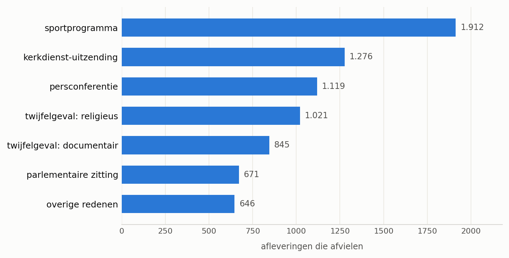
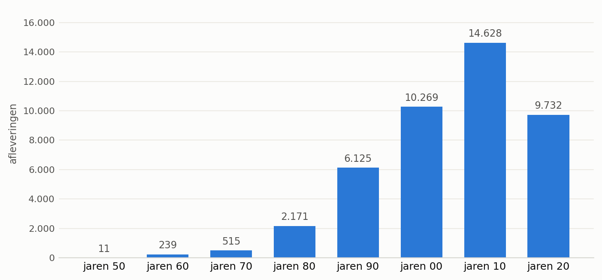
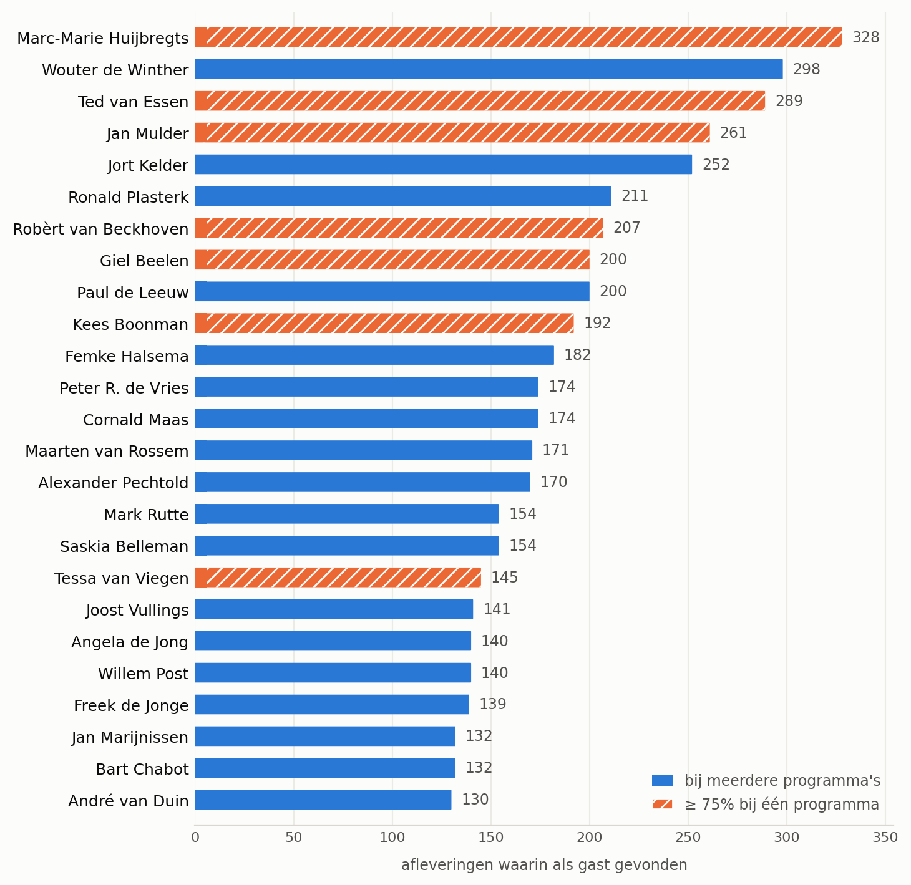
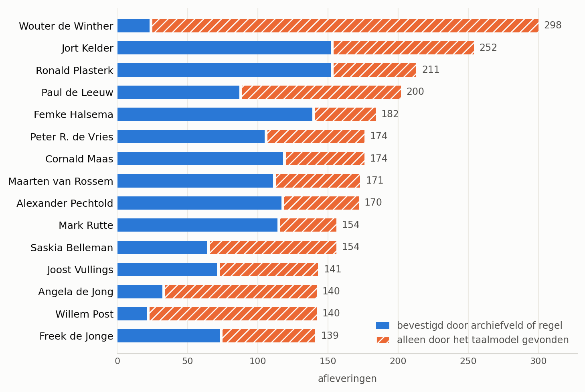

<!-- GEGENEREERD BESTAND - NIET HANDMATIG BEWERKEN.
     Gemaakt door data_story/tools/build_datastory_md.py; elke run
     overschrijft dit bestand volledig.
     Lopende tekst bewerk je in data_story/De_talkshowgast_v2.txt,
     de toegevoegde blokken (auteurs, samenvatting, AI-verklaring)
     in de constanten bovenin dat script. -->

Roeland Ordelman

Manager CLARIAH Media Suite, Beeld &amp; Geluid en Universiteit Twente

<a href="https://orcid.org/0000-0001-9229-0006" target="_blank" rel="noopener">ORCID 0000-0001-9229-0006</a> · <a href="https://www.linkedin.com/in/roelandordelman/" target="_blank" rel="noopener">LinkedIn</a>

Hester Bus

Data Specialist, Beeld &amp; Geluid

<a href="https://www.linkedin.com/in/hester-bus-742085109/" target="_blank" rel="noopener">LinkedIn</a>

Rana Klein

AI-ontwikkelaar, Beeld &amp; Geluid

Met dank aan het Media Suite-team, in het bijzonder Tiago da Costa.

Samenvatting — het korte antwoord

De vraag die binnenkwam: “Wie was de man (zal wel een man zijn) die het vaakst te gast was in een talkshow?”

- Het archief van Beeld & Geluid levert voor deze vraag **880 programmareeksen met 43.711 afleveringen** op, van 1957 tot en met 2026. Daaruit zijn **137.330 gastvermeldingen** gehaald, verdeeld over **51.117 namen**.
- **De vraag heeft niet één antwoord, maar vier** — afhankelijk van wat je een gast noemt en hoe zwaar een vermelding weegt die alleen een taalmodel zag. Een telling waarin niets wordt weggelaten eindigt bij **Marc-Marie Huijbregts** (328 afleveringen). Wie de vraag strikt leest als *wie werd vanwege zijn expertise het vaakst gevraagd* — en dus de tafelheren en mediaprofessionals weglaat die de vraagsteller uitdrukkelijk uitsloot — komt uit bij **Ted van Essen** (289), de huisarts die al jarenlang de vaste medische rubriek van Tijd voor MAX verzorgt. De lijst zonder namen die driekwart of meer van hun optredens bij één programma hadden, begint bij **Wouter de Winther** (298). En wie daarbij eist dat de gast in de catalogus zelf is vastgelegd, komt uit bij **Ronald Plasterk** (211), met Jort Kelder en Femke Halsema er vlak achter.
- **De verwachting vooraf — Frits Wester, met Alexander Pechtold als goede tweede — klopt half.** Pechtold komt uit op 170 afleveringen bij 45 programma's (plek 15 in de hoofdlijst, plek 9 zonder formatgebonden namen). Wester staat op 107 afleveringen, een gedeelde 54e plaats. Dat ligt niet aan meetonzekerheid — 84 van zijn 107 afleveringen zijn archiefbevestigd — maar aan de reikwijdte van het archief: zijn werk voor RTL Nieuws valt er volledig buiten.
- **De gastnamen komen uit vier bronnen in drie methoden**, in afnemende betrouwbaarheid: het gecatalogiseerde GTAA-gastveld, handgeschreven cue-zinnen per reeks, en een lokaal draaiend taalmodel op twee tekstvelden. Per naam is vastgelegd welke bron hem vond.

## 1. Inleiding

Deze data story is de tweede analyse van Nederlandse praatprogramma’s op basis van de collectie van Beeld & Geluid. Een eerdere studie betrof vijftien seizoenen van De Wereld Draait Door [(Van Kemenade et al., 2020)](#ref-van-kemenade-2020); hier is het genre als geheel het onderwerp. De aanleiding was een vraag van de redactie van de VARAgids:

> Wie was de man (zal wel een man zijn) die het vaakst te gast was in een talkshow?
>
> Het gaat ons niet om tafelheren, of -dames (zoals bij DWDD destijds) of vaste gasten à la René van der Gijp in VI (maar dat is geen NPO), het gaat om gasten die vanwege hun expertise geregeld werden gevraagd in Pauw & Witteman, Barend & Witteman, OP1, M, DWDD, etc.

Aan de vraag was een verwachting verbonden: Frits Wester, met Alexander Pechtold als goede tweede.

Een omroeparchief leent zich in beginsel goed voor dit type vraag. Beeld & Geluid bewaart een aanzienlijk deel van wat de Nederlandse publieke omroep sinds haar ontstaan heeft uitgezonden, doorgaans voorzien van een beschrijving die door omroepmedewerkers of archivarissen is ingevoerd. Het tellen van personen die in die beschrijvingen voorkomen lijkt daarmee een kwestie van de juiste zoekopdracht.

Twee complicaties staan die eenvoud in de weg. De eerste betreft de vraag wat een gast is. Marc-Marie Huijbregts zat jarenlang wekelijks aan tafel bij De Wereld Draait Door, en Ted van Essen verzorgt als “Dokter Ted” seizoen na seizoen de vaste medische rubriek bij Tijd voor MAX. Beiden komen in honderden afleveringen voor, maar in een hoedanigheid die zich slecht laat vergelijken met die van een eenmalig uitgenodigde deskundige. Het archief registreert doorgaans dát iemand in een aflevering aanwezig was, en aanzienlijk minder vaak in welke rol.

De tweede complicatie betreft de beschrijvingen zelf. Wat over een aflevering is vastgelegd verschilt sterk per reeks en per periode, doordat de catalogiseerpraktijk in de loop van de decennia herhaaldelijk is gewijzigd. In 1997 kwam er één cataloguskader voor film, televisie en radio; in 2001 werd de GTAA-thesaurus ingevoerd, waaraan ook het gastveld is gekoppeld waarop deze analyse voor een belangrijk deel steunt; in 2006 verschoof het beleid van diep beschrijven naar het beschrijven van méér materiaal in wisselende mate van detail; tussen 2012 en 2015 nam automatische spraakherkenning een deel van het handwerk over. [Manders en Wigham (2024)](#ref-manders-wigham-2024), beiden werkzaam bij het instituut, duiden de sporen die zulke overgangen nalaten aan als metadatabreuken en vergelijken ze met krassen op de lens waardoor naar het archief wordt gekeken: zij veroorzaken blinde vlekken en vertekenen het beeld.

Die twee complicaties hebben een methodologische consequentie. Voor sommige reeksen is expliciet vastgelegd wie te gast was, voor andere is die informatie alleen in een lopende omschrijving terug te vinden, en voor weer andere ontbreekt zij geheel. Een telling die zich beperkt tot het expliciet vastgelegde telt vooral de goed gecatalogiseerde programma’s; een telling die ook de omschrijvingen uitleest moet aannemelijk maken dat daarbij geen namen zijn toegevoegd die er niet stonden. De keuze tussen beide verandert de uitkomst, en de plaats van de breuken in de tijd bepaalt wiens optredens beter zijn vastgelegd dan die van een ander.

Om die reden laat de hoofdvraag zich niet tot één naam herleiden. Een telling van het aantal afleveringen waarin iemand als gast is aangetroffen komt uit bij Marc-Marie Huijbregts. Een telling waarin de personen zijn weggelaten die vrijwel al hun optredens bij één en hetzelfde programma hadden, levert een andere lijst op, met politici, journalisten en duiders die bij uiteenlopende programma’s aanschoven. En wie de vraag het strengst leest — wie werd er vanwege zijn expertise gevraagd, zonder de tafelheren en mediaprofessionals die de vraagsteller uitsloot — komt uit bij Ted van Essen, jarenlang de vaste huisarts van Tijd voor MAX. Elk van die uitkomsten is correct; zij beantwoorden een net iets andere vraag.

## 2. Vraagstelling en afbakening

De gestelde vraag is voor dit onderzoek geoperationaliseerd als: wie kwam, in de programma’s van de Nederlandse publieke omroep die het archief als praatprogramma heeft getypeerd, in de meeste afleveringen als gast voor? Elk element van die formulering is een afbakening, en elke afbakening verschuift de uitkomst. De verwachting van de vraagsteller, Wester en daarna Pechtold, fungeert als vertrekpunt waartegen het resultaat kan worden afgezet.

### 2.1 Afbakening van het corpus

Startpunt is de genretypering die het archief zelf hanteert: praatprogramma. Die typering leverde, met enkele aanvullingen, 1.022 programmareeksen op met samen 51.201 afleveringen. Daarvan resteren 880 reeksen met 43.711 afleveringen, oftewel 85,4 procent van het materiaal. De volledige beoordeling per reeks staat in de bijlage [Welke programma’s zijn meegeteld](/talkshow-gasten/appendix_reeksen/).

Uitgesloten zijn 142 reeksen met 7.490 afleveringen. Katholiek Nederland kerkt in… is met 1.276 afleveringen de omvangrijkste; een kerkdienst is geen gesprek met gasten. Gesprek met de minister-president (1.119 afleveringen) draagt een titel die op een talkshow duidt, maar betreft de wekelijkse persconferentie na de ministerraad. Het Vragenuur (671 afleveringen) kent wisselende sprekers zonder dat iemand er te gast is. Bij twijfelgevallen, doorgaans reeksen met een religieuze, documentaire of muzikale bijtypering, is één regel aangehouden: bij twijfel uitsluiten.

*Figuur 1 — Wat er bij de selectie afviel, per reden. Samen 7.490 van de 51.201 geïndexeerde afleveringen; 43.711 bleven over.*

De cijfers achter figuur 1 — klik om de tabel te openen

| reden | afleveringen |
| --- | --- |
| sportprogramma | 1912 |
| kerkdienst-uitzending | 1276 |
| persconferentie | 1119 |
| twijfelgeval: religieus | 1021 |
| twijfelgeval: documentair | 845 |
| parlementaire zitting | 671 |
| overige redenen | 646 |

In omgekeerde richting zijn veertien reeksen met de hand aan de selectie toegevoegd, samen goed voor 7.411 afleveringen, zeventien procent van het uiteindelijke corpus; zonder die reeksen zou bijna een zesde van de data ontbreken. Buitenhof (1.302 afleveringen) zou zijn afgevallen op een bijtypering als politiek programma, terwijl het het format bij uitstek is waarin deskundigen worden uitgenodigd om iets te duiden. De Nachtzoen (2.027 afleveringen) droeg de typering “overdenking” en zou onder de twijfelgevalregel zijn uitgesloten, terwijl de reeks bestaat uit een gesprek met een wisselende gast.

Twee keer bleek de selectie een lacune te bevatten die met nauwkeuriger classificeren niet was te verhelpen. Op1 draagt in het archief de typering “actualiteiten” en ontbrak daardoor geheel in de oorspronkelijke export; een afzonderlijke export van 1.155 afleveringen is als tweede bronbestand toegevoegd. Daarnaast maakte een controle tegen een openbare lijst van televisiepraatprogramma’s op Wikipedia [(Wikipedia, 2026)](#ref-wikipedia-2026) zichtbaar dat een aantal bekende titels ontbrak, waarop een archivaris van Beeld & Geluid een aanvullende export leverde van zeven reeksen met 2.724 afleveringen, waaronder WNL Goedemorgen Nederland en De Avondshow met Arjen Lubach.

De Wikipedia-lijst telt 110 titels. Daarvan zijn er 44 in het archief teruggevonden en 59 verklaarbaar afwezig, omdat zij afkomstig zijn van RTL, SBS, Talpa of van Vlaamse en buitenlandse zenders. Zes titels waren niet te identificeren omdat het Wikipedia-artikel geen zender noemt. Na navraag bij een archivaris bleken drie van de aanvankelijk vermiste titels wel degelijk aanwezig, alleen onder een andere naam: Sophie & Jeroen maakt deel uit van Khalid & Sophie, NOS Studio Sportzomer staat er als Studio Sportzomer (en valt als sportprogramma buiten de selectie), en Sonja op… is een verzameltitel voor acht afzonderlijke reeksen. Eén titel blijft over als werkelijk gemis: Goedemorgen Nederland van de KRO draagt in de catalogus het genre ‘magazine’ en viel daardoor buiten de export. De titel-voor-titel uitkomst staat in de bijlage [Dekking van de Wikipedia-lijst](/talkshow-gasten/appendix_wikipedia/).

### 2.2 Afbakening van het begrip gast

De laatste afbakening ligt in de telling zelf: wie een programma presenteert, is daar geen gast. Uit de crewgegevens is per aflevering vastgelegd wie de presentatie verzorgde — 48.111 vermeldingen, 937 verschillende namen, over 38.027 afleveringen — en die namen worden bij de gastextractie afgewezen.

Het gewicht van die keuze laat zich aan één geval aflezen. Annemiek Schrijver presenteert in dit archief 1.414 afleveringen, onder meer van De Nachtzoen en Het Vermoeden. Zonder de presentatorfilter zou zij bovenaan de lijst van meest gevraagde talkshowgasten zijn geëindigd; met de filter staat zij op negen afleveringen, de keren dat zij elders daadwerkelijk te gast was.

De selectie bestrijkt een langere periode dan de uitkomsten suggereren. De oudste aflevering dateert van 16 februari 1957 (Die jeugd van tegenwoordig), de jongste van 1 september 2026. Die zeventig jaar zijn zeer ongelijk gevuld: tussen 1957 en 1979 bevat de selectie samen 765 afleveringen, tegen 14.628 in de jaren tien. Het praatprogramma zoals het nu bestaat is een jong genre, en de archiefbeschrijvingen zijn in de loop der jaren uitgebreider geworden. Uitspraken over “zeventig jaar” steunen in de praktijk zwaar op de laatste twintig.

*Figuur 2 — Afleveringen in de selectie per decennium. Van 21 afleveringen ontbreekt een bruikbare datum; die staan niet in de grafiek.*

De cijfers achter figuur 2 — klik om de tabel te openen

| decennium | afleveringen |
| --- | --- |
| jaren 50 | 11 |
| jaren 60 | 239 |
| jaren 70 | 515 |
| jaren 80 | 2171 |
| jaren 90 | 6125 |
| jaren 00 | 10269 |
| jaren 10 | 14628 |
| jaren 20 | 9732 |

Uit deze 43.711 afleveringen zijn uiteindelijk 137.330 gastvermeldingen gehaald, verdeeld over ruim 51.000 verschillende namen. De volgende paragraaf beschrijft hoe die extractie is uitgevoerd en wat daarbij is verworpen.

## 3. Extractie van de gastnamen

Het archief kent geen veld waarin voor elke aflevering is vastgelegd wie te gast was. Beschikbaar is een verzameling informatiecomponenten waarin het antwoord in wisselende mate besloten ligt: een gestructureerd veld dat voor een deel van de reeksen is ingevuld, en beschrijvende teksten waarin gastnamen in een lopende zin voorkomen. Uiteindelijk zijn vier bronnen benut, ondergebracht in drie methoden waarvan de laatste op twee verschillende tekstvelden is toegepast. Zij worden hieronder in afnemende volgorde van betrouwbaarheid behandeld.

### 3.1 Het gastveld van het archief

De eerste bron is het veld program.guest, gekoppeld aan de GTAA-thesaurus en ingevuld door archivarissen of, via een koppeling met hun eigen systemen, door de omroepen zelf; voor recent materiaal is dat laatste het waarschijnlijkst. Het betreft daarmee een gecatalogiseerd gegeven en geen uit tekst afgeleide inferentie. Het veld levert 39.018 gastvermeldingen op, verspreid over 500 reeksen en 13.653 afleveringen, ofwel 31,2 procent van de selectie.

De dekking is ongelijk verdeeld, en wel op de wijze die de metadatabreuken doen verwachten. Bij Pauw & Witteman is het veld gevuld voor 998 van de 1.320 afleveringen (75,6 procent) en bij De Wereld Draait Door voor 1.659 van de 2.714 (61,1 procent). Bij WNL Goedemorgen Nederland betreft het 23 van de 2.157 afleveringen (1,1 procent) en bij Op1 7 van de 1.155 (0,6 procent). Bij het nieuwste materiaal, samen ruim 3.300 afleveringen, is de betrouwbaarste bron dus nagenoeg leeg.

### 3.2 Handgeschreven cue-zinnen

De tweede bron berust op patroonherkenning. Veel afleveringsbeschrijvingen bevatten een vaste aankondigingszin die per reeks met een handgeschreven regel is uit te lezen. De beschrijving van Pauw & Witteman van 7 januari 2008 luidt:

> Deze aflevering zijn te gast: Guus Meeuwis, zanger; Erik van Muiswinkel, cabaretier; Ralph Tuijn, roeier; Ralph Pans, verliezer bij het Utrechtse burgemeestersreferendum.

De regel zoekt op “zijn te gast”, splitst het daaropvolgende deel op puntkomma’s en laat de functieaanduiding na de komma weg, wat vier namen oplevert zonder interpretatiestap. Daar staat tegenover dat de regel niet beter is dan de zin waarop hij is geschreven. De aflevering van Op1 van 3 december 2020 opent met “Fractieleider van D66 Rob Jetten vindt dat de horeca meer ruimte moeten krijgen. Horecaondernemer Bas Hoebink is blij met de oproep…”, zonder aankondigingszin, zodat deze twee gasten worden gemist; verderop in dezelfde beschrijving worden wel vier namen herkend, waarvan twee met de functietitel eraan vast (Documentairemaker Sinan Can en VVD-Kamerlid Dilan Yesilgöz).

Voor twintig reeksen is zo’n regel geschreven en aan voorbeelden getoetst; negentien daarvan leveren resultaat op, samen 15.263 vermeldingen over 6.939 afleveringen, 15,9 procent van de selectie. Waar de regel van toepassing is, is de dekking hoog: bij Het Vermoeden bestrijkt hij 379 van de 383 afleveringen.

### 3.3 Een taalmodel op twee tekstvelden

De derde en de vierde bron zijn beide afkomstig van een taalmodel, dat voor de resterende ruim 860 reeksen is ingezet met één vaste opdracht per aflevering: wie is hier te gast, gegeven deze tekst. De technische verantwoording van het model — versie, quantisatie en parameters — staat in de verklaring over het gebruik van generatieve AI aan het slot; voor het model zelf, zie AI@Meta (2024).

Het model is over twee verschillende beschrijvingsvelden gehaald. Het eerste is de korte programmabeschrijving (summaryshort). Alleen waar die ontbrak, kreeg het model de beschrijvingen van de afzonderlijke onderdelen van de uitzending, de scènebeschrijvingen; dat gebeurde bij 35 afleveringen. Samen leverde dat na controle 126.313 vermeldingen op over 36.517 afleveringen en 813 reeksen. Op program.summary, een tweede en doorgaans rijker veld dat soms een expliciete opsomming van naam en rol bevat, kwamen daar 60.475 vermeldingen bij over 12.034 afleveringen en 595 reeksen.

| bron | vermeldingen | afleveringen | reeksen |
| --- | --- | --- | --- |
| gastveld program.guest | 39.018 | 13.653 (31,2%) | 500 |
| cue-zinnen | 15.263 | 6.939 (15,9%) | 19 |
| taalmodel op summaryshort | 126.313 | 36.517 (83,5%) | 813 |
| taalmodel op program.summary | 60.475 | 12.034 (27,5%) | 595 |
| samengevoegd | 137.330 | 38.983 (89,2%) | 863 |

De bronnen overlappen aanzienlijk: 31,8 procent van de samengevoegde vermeldingen is door meer dan één bron onafhankelijk gevonden. Tegelijk levert elke bron een unieke bijdrage. Zonder het taalmodel op de gewone beschrijvingsvelden zouden 14.334 afleveringen geen enkele gast opleveren, zonder het tweede tekstveld 1.917, zonder het gastveld 289 en zonder de handgeschreven regels 76. De twee betrouwbaarste bronnen dragen daarmee het minst bij aan de dekking en de minst betrouwbare het meest.

### 3.4 Controles op de modeluitvoer

Op de uitvoer van het taalmodel zijn drie controles toegepast. Van elke controle is een bestand bewaard met de verwijderde vermeldingen en de brontekst waarop het oordeel berust.

De eerste controle betreft hallucinaties: namen die het model produceert zonder dat zij in de aangeboden tekst voorkomen. Elke naam is teruggezocht in exact de tekst die het model kreeg; ontbreekt de naam daarin, dan is de vermelding verwijderd. Van de 193.101 gecontroleerde namen zijn er op deze grond 6.313 verwijderd, ofwel 3,27 procent. Eén naam, Jip Janssen, kwam 945 maal uit het model zonder ook maar eenmaal in de aangeboden tekst voor te komen, verspreid over 72 reeksen en de jaren 1958 tot 2026. In 802 van die 945 gevallen was de aangeboden tekst korter dan veertig tekens, doorgaans niet meer dan “In deze aflevering:”, een dubbele punt zonder vervolg. Het model hallucineert dus vooral bij afwezigheid van bruikbare invoer.

De tweede controle ondervangt een rolverwisseling: het model merkte soms iemand als gast aan die voor die aflevering juist de gecrediteerde presentator was. Dat deed zich 1.684 maal voor, 0,90 procent van de modelvermeldingen. Paul de Leeuw vormt het duidelijkste geval, 200 maal aangemerkt waarvan 192 maal bij zijn eigen Laat de Leeuw. Zulke vermeldingen zijn onvoorwaardelijk verwijderd, tegen de prijs dat 384 afleveringen daardoor geen enkele gast meer overhouden.

De derde ingreep is een keuze en geen correctie. Wanneer het gastveld of een handgeschreven regel voor een aflevering al minstens één naam had opgeleverd, is een naam die uitsluitend door het taalmodel is gevonden niet toegevoegd. Dat kost 42.097 vermeldingen, 22,54 procent van de modeluitvoer, en gaat ten dele ten koste van werkelijke gasten. De rechtvaardiging is dat de fout die deze regel voorkomt zich aan detectie onttrekt. Het model wijst namelijk soms iemand aan die uitsluitend het onderwerp van een item was. In De Dino Show van 26 mei 2013 luidt de beschrijving onder meer “Item over nieuwe vriend van mediapersoonlijkheid Patricia Paay”; het model noteerde Patricia Paay als gast, terwijl het gastveld voor die aflevering Jasmine Sendar, Irene Moors en rapper Hef geeft. Een dergelijke fout ontsnapt aan de twee voorgaande controles, omdat de naam wel degelijk in de brontekst staat. Zulke gevallen concentreren zich in afleveringen zonder aankondigingszin, juist daar waar het model de enige bron is.

Na toepassing van de drie controles resteren 137.330 gastvermeldingen over 38.983 afleveringen, 89,2 procent van de selectie. Van 4.728 afleveringen is geen enkele gastnaam bekend.

## 4. Resultaten

### 4.1 De ongefilterde telling

De extractie levert een lijst van 51.117 namen op, waarvan de bovenkant in figuur 3 is weergegeven. De bijlage [De volledige ranglijst](/talkshow-gasten/appendix_ranglijst/) geeft de hoogste honderd namen, met per naam hoeveel van hun afleveringen door het archiefveld of een regel zijn bevestigd.

*Figuur 3 — De 25 vaakst gevonden talkshowgasten, 1957–2026. Oranje en gearceerd: namen die 75 procent of meer van hun optredens bij één en hetzelfde programma hadden.*

De cijfers achter figuur 3 — klik om de tabel te openen

| naam | bij meerdere programma's | ≥ 75% bij één programma | totaal | hoofdreeks | aandeel hoofdreeks |
| --- | --- | --- | --- | --- | --- |
| Marc-Marie Huijbregts | 0 | 328 | 328 | DE WERELD DRAAIT DOOR | 0.94 |
| Wouter de Winther | 298 | 0 | 298 | WNL GOEDEMORGEN NEDERLAND | 0.6 |
| Ted van Essen | 0 | 289 | 289 | TIJD VOOR MAX | 0.98 |
| Jan Mulder | 0 | 261 | 261 | DE WERELD DRAAIT DOOR | 0.84 |
| Jort Kelder | 252 | 0 | 252 | DE WERELD DRAAIT DOOR | 0.37 |
| Ronald Plasterk | 211 | 0 | 211 | BUITENHOF | 0.59 |
| Robèrt van Beckhoven | 0 | 207 | 207 | TIJD VOOR MAX | 0.93 |
| Giel Beelen | 0 | 200 | 200 | DE WERELD DRAAIT DOOR | 0.85 |
| Paul de Leeuw | 200 | 0 | 200 | DE WERELD DRAAIT DOOR | 0.28 |
| Kees Boonman | 0 | 192 | 192 | TIJD VOOR MAX | 0.94 |
| Femke Halsema | 182 | 0 | 182 | PAUW & WITTEMAN | 0.2 |
| Peter R. de Vries | 174 | 0 | 174 | DE WERELD DRAAIT DOOR | 0.15 |
| Cornald Maas | 174 | 0 | 174 | TV 3 | 0.26 |
| Maarten van Rossem | 171 | 0 | 171 | STUDIO 2 | 0.12 |
| Alexander Pechtold | 170 | 0 | 170 | PAUW & WITTEMAN | 0.22 |
| Mark Rutte | 154 | 0 | 154 | PAUW & WITTEMAN | 0.18 |
| Saskia Belleman | 154 | 0 | 154 | Op1 | 0.32 |
| Tessa van Viegen | 0 | 145 | 145 | WNL GOEDEMORGEN NEDERLAND | 0.77 |
| Joost Vullings | 141 | 0 | 141 | Op1 | 0.43 |
| Angela de Jong | 140 | 0 | 140 | WNL GOEDEMORGEN NEDERLAND | 0.44 |
| Willem Post | 140 | 0 | 140 | WNL GOEDEMORGEN NEDERLAND | 0.59 |
| Freek de Jonge | 139 | 0 | 139 | DE WERELD DRAAIT DOOR | 0.27 |
| Jan Marijnissen | 132 | 0 | 132 | PAUW & WITTEMAN | 0.18 |
| Bart Chabot | 132 | 0 | 132 | PAUW & WITTEMAN | 0.33 |
| André van Duin | 130 | 0 | 130 | DE WERELD DRAAIT DOOR | 0.24 |

De verdeling is goed scheef. Van de 51.117 namen komt 74,4 procent in precies één aflevering voor, zodat de mediaan op één aflevering ligt; 61 namen halen er honderd of meer en negen halen er tweehonderd of meer. De honderd hoogst genoteerde namen zijn samen goed voor 12.335 van de 137.330 gastvermeldingen, negen procent. In negen van de tien gevallen waarin iemand in dit archief als gast is aangetroffen, gaat het dus om iemand buiten die top-100.

De bovenkant van de lijst is correct geteld en beantwoordt de gestelde vraag desondanks niet, wat het scherpst zichtbaar wordt bij de twee namen die op hetzelfde aantal uitkomen. Giel Beelen en Paul de Leeuw staan beiden op 200 afleveringen. Van Beelen vallen er 171 bij De Wereld Draait Door, terwijl De Leeuw zijn tweehonderd optredens verdeelt over 65 verschillende programma’s, met 57 bij zijn grootste. Achter hetzelfde getal gaan twee onvergelijkbare vormen van aanwezigheid schuil.

Dat onderscheid loopt door de gehele top-25. Ted van Essen haalt 289 afleveringen, waarvan 284 bij Tijd voor MAX, waar hij als “Dokter Ted” al jarenlang de vaste huisarts van het programma is; Kees Boonman komt op 192, waarvan 180 bij diezelfde reeks. Daartegenover staan Maarten van Rossem met 171 afleveringen over 53 programma’s en Femke Halsema met 182 over 61.

Twee verdere observaties zijn van belang. Elf van de 25 hoogst genoteerde namen staan elders in dit archief zelf als presentator geregistreerd, wat iets zegt over de samenstelling van het gastenbestand: voor een aanzienlijk deel bestaat het uit de mediawereld zelf. Daarnaast drukken de nieuwste reeksen zwaar door. Vier namen in de top-25 zijn overwegend afkomstig van WNL Goedemorgen Nederland, dat pas sinds 2015 in de data voorkomt, en twee van Op1. Een programma dat elke werkdag uitzendt en gasten laat terugkeren produceert in tien jaar meer vermeldingen dan een wekelijks programma in dertig jaar.

### 4.2 Signalen voor formatgebondenheid

Om de twee vormen van aanwezigheid te kunnen onderscheiden zijn drie signalen berekend. Geen daarvan verwijdert namen uit de lijst; zij markeren slechts.

Het bruikbaarste signaal is tevens het eenvoudigste: het aandeel van iemands afleveringen dat bij de grootste reeks valt. Boven 0,75 krijgt een naam het label waarschijnlijk formatgebonden. Over de gehele lijst betreft dat 40.495 namen, een weinig informatief getal, aangezien driekwart van alle namen slechts eenmaal voorkomt en dus per definitie voor honderd procent bij die ene reeks hoort. In de bovenkant van de lijst functioneert het signaal wel: het markeert twaalf namen in de top-100 en zeven in de top-25. De scheiding is daarmee nog niet scherp: in de top-40 bevinden zich weliswaar negentien namen onder 0,40 en elf op of boven 0,75, maar ook tien daartussenin, onder wie Ronald Plasterk (0,59) en Claudia de Breij (0,66), zodat de gekozen drempelwaarde in zoverre een conventie blijft.

De twee overige signalen betreffen concentratie binnen één reeks en terugkeer over meerdere jaren. Het eerste markeert 380 namen, het tweede 1.116; dat tweede signaal markeert echter ook 85 van de top-100 en onderscheidt in de bovenkant dus nauwelijks nog.

De sterkste aanwijzing is afkomstig uit de archiefbeschrijvingen zelf. Het woord tafelheer, tafelheren of tafeldame komt letterlijk voor in de brontekst van 2.123 afleveringen, waarvan er 2.115 bij één programma horen: De Wereld Draait Door, tussen 2005 en 2020. Wie deze reeks beschreef, noteerde de rol expliciet, hetzij tussen haakjes achter de naam (“Jan Mulder, columnist (tafelheer), over het winterse weer”), hetzij voluit (“Deze aflevering met als tafelheer Marc-Marie Huijbregts”). Voor de vaakst genoemde DWDD-gasten is geteld in hoeveel van hun afleveringen hun achternaam binnen zeventig tekens van dat woord voorkomt.

| naam | DWDD-afleveringen | naam bij “tafelheer” |
| --- | --- | --- |
| Marc-Marie Huijbregts | 307 | 278 |
| Jan Mulder | 218 | 172 |
| Giel Beelen | 171 | 137 |
| Claudia de Breij | 85 | 75 |
| Jort Kelder | 92 | 60 |
| Paul de Leeuw | 57 | 43 |
| Prem Radhakishun | 84 | 35 |
| Felix Rottenberg | 65 | 9 |

Het betreft een nabijheidstelling en geen rolveld: staat het woord in een opsomming met meerdere namen, dan kan het op een ander betrekking hebben. Het verschil tussen 278 van de 307 en 9 van de 65 is niettemin te groot om aan toeval te worden toegeschreven. Buiten De Wereld Draait Door is het woord achtmaal gebruikt, verspreid over zeven reeksen, wat erop wijst dat de rol elders wel werd vervuld maar zelden werd vastgelegd.

Hetzelfde verschijnsel is negen jaar eerder geconstateerd. In 2015 publiceerde NRC een analyse van tien jaar De Wereld Draait Door door de LJS Nieuwsmonitor, die eveneens bij Marc-Marie Huijbregts uitkwam, met 243 vermeldingen. LJS werkte op dezelfde data van Beeld & Geluid, alleen via de website verkregen in plaats van rechtstreeks uit het archief. Wat de vergelijking illustreert is de afhankelijkheid van de uitkomst van de gekozen route: voor dezelfde persoon, hetzelfde programma en dezelfde looptijd geeft het gastveld 252 afleveringen, geeft de volledige pijplijn er 307 en kwam LJS op 243, een spreiding van ruim een kwart tussen de laagste en de hoogste uitkomst.

### 4.3 De cross-formatranglijst

Worden de namen weggelaten die driekwart of meer van hun optredens bij één programma hadden, dan resteren 10.622 van de 51.117 namen.

| naam | afl. | reeksen | archief-bevestigd |
| --- | --- | --- | --- |
| Wouter de Winther | 298 | 9 | 1 |
| Jort Kelder | 252 | 42 | 131 |
| Ronald Plasterk | 211 | 37 | 150 |
| Paul de Leeuw | 200 | 65 | 84 |
| Femke Halsema | 182 | 61 | 127 |
| Peter R. de Vries | 174 | 48 | 90 |
| Cornald Maas | 174 | 38 | 100 |
| Maarten van Rossem | 171 | 53 | 90 |
| Alexander Pechtold | 170 | 45 | 102 |
| Mark Rutte | 154 | 49 | 109 |

Deze lijst beantwoordt de vraag zoals zij vermoedelijk was bedoeld: politici, journalisten, een oud-minister, een historicus die bij uiteenlopende programma’s aanschuift, een misdaadverslaggever. Het gaat om personen die werden uitgenodigd omdat er iets te duiden viel, verspreid over tientallen programma’s.

De hoogst genoteerde naam vraagt wel om een voorbehoud. Van de 298 afleveringen van Wouter de Winther is er één in het gastveld terug te vinden; 275 daarvan, 92 procent, berusten uitsluitend op het taalmodel. Hij is bovendien gemarkeerd als mogelijke sidekick, en 178 van zijn afleveringen vallen bij WNL Goedemorgen Nederland, de reeks waarvoor het gastveld bij 23 van de 2.157 afleveringen is ingevuld. De metadatabreuk uit paragraaf 1 krijgt hier een concrete uitwerking voor één naam.

*Figuur 4 — De vijftien hoogste namen zonder formatgebonden vermeldingen, per naam opgesplitst naar bewijskracht. Blauw: afleveringen die het gastveld of een handgeschreven regel bevestigt. Oranje en gearceerd: afleveringen die alleen het taalmodel vond.*

De cijfers achter figuur 4 — klik om de tabel te openen

| naam | bevestigd door archiefveld of regel | alleen door het taalmodel gevonden | totaal | aandeel alleen taalmodel (%) |
| --- | --- | --- | --- | --- |
| Wouter de Winther | 23 | 275 | 298 | 92.3 |
| Jort Kelder | 152 | 100 | 252 | 39.7 |
| Ronald Plasterk | 152 | 59 | 211 | 28.0 |
| Paul de Leeuw | 87 | 113 | 200 | 56.5 |
| Femke Halsema | 139 | 43 | 182 | 23.6 |
| Peter R. de Vries | 105 | 69 | 174 | 39.7 |
| Cornald Maas | 118 | 56 | 174 | 32.2 |
| Maarten van Rossem | 111 | 60 | 171 | 35.1 |
| Alexander Pechtold | 117 | 53 | 170 | 31.2 |
| Mark Rutte | 114 | 40 | 154 | 26.0 |
| Saskia Belleman | 64 | 90 | 154 | 58.4 |
| Joost Vullings | 71 | 70 | 141 | 49.6 |
| Angela de Jong | 32 | 108 | 140 | 77.1 |
| Willem Post | 21 | 119 | 140 | 85.0 |
| Freek de Jonge | 73 | 66 | 139 | 47.5 |

De mediaan in deze top-15 ligt op veertig procent alleen-taalmodel. Femke Halsema komt uit op 24 procent, Mark Rutte op 26 en Ronald Plasterk op 28. De drie uitschieters aan de andere zijde zijn alle drie afkomstig van WNL Goedemorgen Nederland.

Bij sortering van dezelfde 10.622 namen op het aantal door het gastveld bevestigde afleveringen kantelt de lijst. Ronald Plasterk komt dan bovenaan met 150, gevolgd door Jort Kelder (131), Femke Halsema (127), Mark Rutte (109) en Alexander Pechtold (102); Wouter de Winther zakt met zijn ene bevestigde aflevering naar regel 5.341 van de 10.622.

### 4.4 Toetsing van de verwachting vooraf

Alexander Pechtold komt uit op 170 afleveringen over 45 programma’s, tussen 2005 en 2026, waarvan er 102 door het gastveld zijn bevestigd. Dat is regel 15 van de hoofdlijst en plek 9 van de lijst zonder formatgebonden namen. Als goede tweede lag de verwachting dicht bij de uitkomst.

Frits Wester komt uit op 107 afleveringen over 32 programma’s, tussen 1994 en 2024, een gedeelde 54e plaats omdat Mart Smeets op hetzelfde aantal uitkomt, en plek 43 in de cross-formatlijst. Zijn positie berust op stevig materiaal: 84 van zijn 107 afleveringen zijn door het gastveld bevestigd en slechts 14, dertien procent, berusten uitsluitend op het taalmodel. Bij sortering van de top-100 op dat percentage staat hij vijfde van onderen, tegen een mediaan van 48 procent. Zijn lage score heeft dus een andere oorzaak dan meetonzekerheid.

Die oorzaak is de reikwijdte van het archief. Wester ontleent zijn bekendheid aan zijn werk als politiek verslaggever bij RTL Nieuws, en in de gehele classificatie komt geen enkele reeks met RTL in de titel voor. Wat van hem in de data aanwezig is betreft uitsluitend zijn gastoptredens bij de publieke omroep. Daaruit verklaart zich ook waarom de presentatorvlag bij hem ontbreekt terwijl Pechtold die wel draagt, op grond van zes afleveringen van De Achterkant van het Gelijk in het voorjaar van 2021.

De vraag bevatte een tweede vermoeden: “zal wel een man zijn”. De bovenkant van beide lijsten stelt de vraagsteller daarin in het gelijk. De hoogst genoteerde vrouw is Femke Halsema, op plek 11 van de hoofdlijst en plek 5 van de cross-formatlijst. Daarbij past de kanttekening dat het archief van gasten geen geslacht vastlegt; deze vaststelling berust op handmatige inspectie van de bovenste namen en houdt verderop in de lijst op bruikbaar te zijn.

### 4.5 Vier lezingen

Een telling waarin niets wordt weggelaten eindigt bij Marc-Marie Huijbregts. Wie de vraag strikt leest als wie vanwege zijn expertise het vaakst werd gevraagd, en dus de tafelheren en mediaprofessionals weglaat die de vraagsteller uitdrukkelijk uitsloot, komt uit bij Ted van Essen. De cross-formatlijst gelezen zoals zij er staat komt uit bij Wouter de Winther. En de eis dat het antwoord ook in de catalogus zelf is vastgelegd leidt naar Ronald Plasterk, met Jort Kelder en Femke Halsema er vlak achter.

Alle vier de antwoorden komen voort uit dezelfde data en dezelfde bewerkingen. Het verschil ligt in het gewicht dat wordt toegekend aan een vermelding die alleen een taalmodel heeft gezien, en in de vraag of een vaste wekelijkse tafelgast of rubriekgast als gast meetelt. De vier uitkomsten worden hier naast elkaar gepresenteerd en de weging wordt aan de lezer gelaten, omdat de data zelf geen grond bieden om er één van te schrappen.

## 5. Grenzen van dit onderzoek

### 5.1 Reikwijdte van de ranglijst

De bovenste honderd namen zijn bruikbaar als antwoord op de gestelde vraag; de rest van de lijst heeft het karakter van een inventarisatie van wie ooit is genoemd. Voor 35.416 van de 51.117 namen, 69 procent, bestaat buiten het taalmodel geen enkele bevestiging. Bij de 38.016 namen die precies eenmaal voorkomen loopt dat op tot 80 procent, en over alle vermeldingen samen berust 62 procent van de 137.330 uitsluitend op het model.

In de bovenkant is het beeld omgekeerd. In de top-100 staat één naam zonder enige bevestiging buiten het model: Tessa van Viegen, 145 afleveringen waarvan 111 bij WNL Goedemorgen Nederland, gemarkeerd als mogelijke sidekick. Pas in de top-1000 loopt dat aantal op tot 36. Wie de volledige lijst als dataset gebruikt, werkt voor ruim twee derde van de namen met materiaal dat alleen een taalmodel heeft gezien: bruikbaar om patronen te verkennen, te dun om een afzonderlijke vermelding op te vertrouwen.

### 5.2 Namen die geen namen zijn

Van de regels in de lijst bestaan er 3.800, 7,4 procent, uit één woord, waaronder duidelijke niet-namen: ouders (48 afleveringen), jongeren (43), deskundigen (37) en vrouw (26). Nog eens 242 regels hebben de vorm van een lidwoord met een zelfstandig naamwoord, zoals de koppels (16), de kinderen (9) en de hoofdgast (6). Voor de uitkomst is dat van weinig belang, aangezien alleen ouders de top-300 haalt.

Hardnekkiger is de losse achternaam. De Vries staat op tien afleveringen, en in een omschrijving als “studiogesprek met De Vries, De Hond en Rottenberg” is met deze methode geen voornaam te achterhalen, zodat verschillende personen onder één regel worden opgeteld.

Schrijfwijzen zijn evenmin samengevoegd. Er zijn 744 groepen namen die alleen in hoofdletters, accenten of koppeltekens verschillen en als afzonderlijke regels in de lijst staan, samen 818 regels te veel: Marc-Marie Huijbregts (328 afleveringen) en Marc Marie Huijbregts (2) tellen apart, evenals Robèrt van Beckhoven (207) en Robert van Beckhoven (2). In de bovenkant gaat het telkens om enkele afleveringen, te weinig om de volgorde te wijzigen. Eén geval is met de hand samengevoegd: de twee schrijfwijzen van Arend Jan Boekestijn kwamen samen op 83 afleveringen, voldoende voor plek 98, terwijl zij afzonderlijk beide buiten de top-100 vielen.

### 5.3 Wat niet is gemeten

De telling geschiedt per aflevering. Wie twee minuten aanschoof telt even zwaar als wie het hele uur bleef, zodat over spreektijd, prominentie of de vraag wie het gesprek bepaalde geen uitspraken mogelijk zijn. Het archief legt evenmin vast wie is gevraagd en heeft afgezegd, of in welke hoedanigheid iemand aanschoof; van gasten worden geslacht, leeftijd noch beroep geregistreerd. Van 4.728 van de 43.711 afleveringen, 10,8 procent, is geen enkele gastnaam bekend.

De handmatige controle is noodgedwongen beperkt gebleven. Van 38 extracties is met de hand beoordeeld of zij juist waren: 33 correct, 3 onzeker, 2 onjuist. Dat is te weinig om als validatie te gelden, en de controle dekt bovendien alleen de regelgebaseerde laag, die op 20 van de 880 reeksen is toegepast.

De scherpste samenvatting van deze beperkingen ligt in de vergelijking met de analyse van NRC uit 2015. Voor één persoon, één programma en één looptijd leverden drie manieren om hetzelfde archief te bevragen 243, 252 en 307 afleveringen op.

## 6. Reproduceerbaarheid en vervolg

De voorbeelden in dit artikel zijn voor onderzoekers met een inlog in de Media Suite zelf na te lopen ([toegang verloopt via een instellingsaccount van een Nederlandse universiteit of hogeschool](https://mediasuite.clariah.nl/documentation/faq/who-can-access)). Via de Media Suite kan de volledige metadata worden ingezien en het bronmateriaal zelf. Hieronder staan directe links naar de Media Suite voor een aantal voorbeelden, en ook naar de Schatkamer van Beeld & Geluid: hier kan iedereen materiaal bekijken of er informatie over inzien voor zover dat beschikbaar is.

| wat er te zien is | aflevering | Media Suite | Schatkamer |
| --- | --- | :---: | :---: |
| een aflevering met het gastveld volledig ingevuld | Pauw & Witteman, 7 januari 2008 |  |  |
| een cue-zin die werkt, en twee gasten die hij mist | Op1, 3 december 2020 |  |  |
| een beschrijving zonder namen waarbij het model er twee toevoegde | 1 Euro per gesprek, 12 januari 2022 |  |  |
| een naam die door de voorrangsregel is verwijderd | De Dino Show, 26 mei 2013 |  |  |
| de tafelheer-aanduiding in de brontekst | De Wereld Draait Door, 19 november 2010 |  |  |
| de verklaring voor de positie van Frits Wester | zoekopdracht op zijn naam | — |  |

De complete dataset wordt op aanvraag voor onderzoek beschikbaar gesteld via de beveiligde analyseomgeving [SANE](https://www.surf.nl/diensten/rekenen/sane), zodat andere onderzoekers erop kunnen voortbouwen. SANE is ontwikkeld met SURF om onderzoek mogelijk te maken op beschermde data, zoals privacy gevoelige data of in dit geval, data dat onder auteursrecht valt. In SANE kan een onderzoeker wel analyses doen op de data maar de data niet downloaden. Voor de hele set praatprogramma's is het plan om alle beschikbare verrijkingen toe te voegen (spraakherkenning, gezichtsherkenning, sprekerlabeling), waarmee aanvullende, meer diepgravende analyses mogelijk worden. Denk aan werkelijke spreek- of beeldtijd of inhoudelijke analyses van de gesprekken. Praatprogramma's bepalen in grote mate waar het land over praat en op welke toon dat debat gevoerd wordt en verdienen als spil in onze democratische samenleving een kritische blik. Met de beschikbaarstelling voor onderzoek van een zo volledig mogelijke dataset nodigen we onderzoekers uit hier een steentje aan bij te dragen.

## Verklaring van het gebruik van generatieve AI

Tijdens de voorbereiding en uitvoering van dit onderzoek is gebruikgemaakt van generatieve kunstmatige intelligentie (AI) voor het analyseren van de onderzoeksdata. Specifiek is Meta Llama 3.1 8B Instruct [(AI@Meta, 2024)](#ref-ai-meta-2024) ingezet via het Ollama-framework (versie 0.32.15), lokaal gedraaid in de 4-bits gekwantiseerde variant `Q4_K_M` (digest `46e0c10c039e`). De inferentie gebruikte een temperatuur van 0 en JSON-afgedwongen uitvoer, met maximaal 250 uitvoertokens; `top_p` is niet gezet en stond daarmee op de standaardwaarde van Ollama, 0,9; bij een temperatuur van 0 heeft die waarde geen effect, omdat het model dan steeds het meest waarschijnlijke token kiest. Er is geen systeemprompt gebruikt; de volledige instructie staat in de bijlage [Hoe de namen zijn gevonden](/talkshow-gasten/appendix_extractie/). Twee parameters zijn gedurende het onderzoek gewijzigd, zoals beschreven in paragraaf 3.3.

Het model is uitsluitend gebruikt voor het uitlezen van gastnamen uit de beschrijvende tekstvelden. Waar het gecatalogiseerde gastveld of een handgeschreven regel al een naam opleverde, is de uitvoer van het model voor die aflevering niet meegeteld. Uitgangspunt was dat het archiefmateriaal het gebouw niet uit gaat: de beschrijvingen zijn niet naar een externe dienst gestuurd, het model draaide op de eigen machine. De prijs daarvan is dat het noodgedwongen een relatief klein model is; de hallucinatiecijfers in paragraaf 3.4 zijn daar wellicht voor een deel op terug te voeren.

Het schrijven van de code is gedaan met behulp van Claude Code, met losse voorbeeldregels uit de data om de scripts te testen. Die voorbeeldregels vormen de enige archiefbeschrijvingen die een externe dienst hebben bereikt. De scripts zijn vervolgens lokaal op de volledige data uitgevoerd: van het bouwen van een index tot drie manieren om te achterhalen wie er te gast was, elke stap als een los en herdraaibaar script, in totaal een pijplijn van zeventien componenten met tussenbestanden per deelresultaat.

Tijdens het schrijfproces is Claude (Anthropic) ingezet, in verschillende versies over de periode augustus–september 2026. Daarbij zijn grove conceptteksten opgesteld op basis van afzonderlijke informatiecomponenten — de methodiek, de cijfers uit de tussenbestanden — en zijn de in de tekst genoemde getallen tegen die bronbestanden gecontroleerd. Ook tekstredactie en stilistische verfijning maakten daarvan deel uit. Aan de uiteindelijke formulering is in meerdere ronden en in wisselende stijlen gewerkt; elk concept is door de auteurs herschreven, gecontroleerd en goedgekeurd. Het model is niet gebruikt om zelfstandig inhoudelijke claims, data of kernconclusies te genereren. De auteurs blijven volledig verantwoordelijk voor de inhoud, de wetenschappelijke integriteit en de uiteindelijke formulering van dit artikel.

## Terzijde

De Media Suite is opgezet als een omgeving voor onderzoekers en journalisten om onderzoek te doen met archiefdata.  Deze omgeving maakt het mogelijk om patronen in en verbanden tussen meerdere programma’s, in meer of mindere mate gebruik makend van innovatieve technieken, te onderzoeken. De Data Stories die de Media Suite publiceert vertellen de verhalen van dat onderzoek: hoe het is uitgevoerd, welke technieken er zijn toegepast, en wat de resultaten zijn, en verwijzen waar mogelijk terug naar (voorbeelden in) het archief zelf, zodat het verhaal het archief als het ware in zich meetrekt. Uiteraard is het daarbij van cruciaal belang dat de data stories goed  uitleggen welke keuzes er gemaakt zijn, waarom deze keuzes zo gemaakt zijn  en hoe tot de resultaten is gekomen.

In mijn dagelijkse praktijk ben ik vooral veel aan het vergaderen over onderzoek dat anderen met de Media Suite (willen) doen. Toen de vraag over talkshowgasten begin zomer 2026 bij ons binnenkwam om uit te zoeken wie het vaakst te gast was in een talkshow, vond ik het een mooie kans om in een paar zomerweken vier dingen tegelijk te doen: zelf werken met de data waar ik het dagelijks over heb, uitzoeken wat er met AI verantwoord mogelijk is, daar zelf en als organisatie van leren, en de dataset en de werkwijze zo achterlaten dat een ander onderzoeker ermee verder kan.

Grappigste leermoment: Na een tijdje sleutelen aan regels en promptvarianten stelde ik de vraag of er niet gewoon een veld zou moeten bestaan waarin archivarissen vastleggen wie er te gast was. Dat veld bleek te bestaan — program.guest, gekoppeld aan de GTAA-thesaurus — en werd binnen een dag de betrouwbaarste bron in de hele pijplijn. Eerst grondig nalopen wat er al ligt en dan pas zelf iets bouwen: die volgorde leverde in één middag meer op dan weken bouwen. Voor iemand die een onderzoeksinfrastructuur beheert is dat een ongemakkelijke les, en precies daarom het vermelden waard.

— Roeland Ordelman

## Bijlagen

Bij dit artikel horen vier bijlagen met het onderliggende materiaal.

- **[Hoe de namen zijn gevonden](/talkshow-gasten/appendix_extractie/)**  
  De handgeschreven regels per reeks en de letterlijke instructie aan het taalmodel.
- **[Welke programma's zijn meegeteld](/talkshow-gasten/appendix_reeksen/)** — 1.022 regels  
  Alle beoordeelde programmareeksen, met de reden waarom ze wel of niet in de analyse zitten.
- **[De volledige ranglijst](/talkshow-gasten/appendix_ranglijst/)** — 100 regels  
  De 100 vaakst gevonden namen, met per naam hoeveel afleveringen door het archiefveld of een regel zijn bevestigd.
- **[Dekking van de Wikipedia-lijst](/talkshow-gasten/appendix_wikipedia/)** — 110 regels  
  De 110 titels van de Wikipedia-lijst van televisiepraatprogramma's, naast het archief gelegd.

## Referenties

- Manders, T. & Wigham, M. (2024). Metadata fractures — don’t let them undermine your work! Beeld & Geluid, 24 januari 2024. https://data.beeldengeluid.nl/showcases/data-fractures
- Van Kemenade, P., Koppelman, W., Van Noord, N., Ordelman, R., Van Peteghem, M. & Wigham, M. (2020). 15 years of the popular Dutch chat show ‘DWDD’ — in data. Media Suite Data Stories, 27 maart 2020. https://mediasuitedatastories.clariah.nl/DWDD/
- NRC (2015). Jan Mulder kwam ’t vaakst, 6 oktober 2015. Onderzoek: LJS Nieuwsmonitor (Nel Ruigrok, Wouter van Atteveld, Floris de Boer), 1.537 uitzendingen.
- Wikipedia. Lijst van televisiepraatprogramma’s, geraadpleegd 28 juli 2026. https://nl.wikipedia.org/wiki/Lijst_van_televisiepraatprogramma's
- GTAA — Gemeenschappelijke Thesaurus Audiovisuele Archieven, Beeld & Geluid. https://gtaa.beeldengeluid.nl
- SANE — beveiligde analyseomgeving. https://www.surf.nl/diensten/rekenen/sane
- AI@Meta (2024). The Llama 3 Herd of Models. arXiv preprint arXiv:2407.21783. https://arxiv.org/abs/2407.21783

## Hoe te citeren

Ordelman, R., Bus, H. & Klein, R. (2026). *Wie is de meest gevraagde talkshowgast bij de publieke omroep?* Media Suite Data Stories, 29 september 2026. https://mediasuitedatastories.clariah.nl/talkshow-gasten/

Dit artikel is beschikbaar onder een [CC BY 4.0-licentie](https://creativecommons.org/licenses/by/4.0/): hergebruik mag, met bronvermelding. De brontekst van dit artikel staat in [beeldengeluid/data-stories](https://github.com/beeldengeluid/data-stories/blob/main/content/blog/talkshow-gasten/index.en.md).

